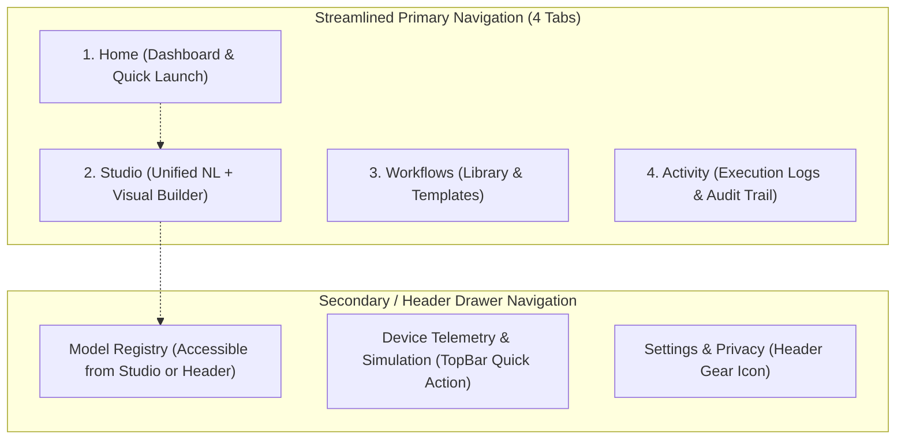

# Technical & UX Frontend Audit Report
## EL-06 — General-Purpose No-Code AI Automation Platform for Android

**Audited Repository:** `ai-automation-platform`  
**Team / Project ID:** SATYAGRAH 2.0 / EL-06  
**Target Platform:** Android (Hybrid Mobile Web + Native Android Architecture Layer)  
**Report Type:** Baseline Technical & UX Architecture Audit  
**Date:** October 2026  
**Status:** Audit Complete — Working Prototype Verified  

---

## Executive Overview

This audit establishes a technical, functional, and UX baseline for **EL-06: General-Purpose No-Code AI Automation Platform for Android**. The repository contains a functional prototype pairing a React 18 / TypeScript frontend with a mirrored Kotlin/Android architecture package (`com.satyagrah.el06`).

The platform realizes the guiding principle:
> **USER SPECIFIES WHAT — PLATFORM DETERMINES HOW**

The platform allows users to input natural language intents (or visually compose workflows), parses them into strongly typed Directed Acyclic Graphs (DAGs), validates graph topology and data-type compatibility, evaluates real-time device resource telemetry (RAM headroom, battery percentage, charging state, thermal throttling, network connectivity, and hardware delegates like NPU/GPU), autonomously selects and ranks models from a curated model registry, dynamically manages model memory lifecycles via LRU eviction, routes execution between on-device hardware and cloud endpoints, caches intermediate results using deterministic hashing, and invokes Android device actions.

```mermaid
graph TD
    subgraph UI_Layer ["Presentation & Intent Layer (src/ui/)"]
        TopBar["TopBar & Android Notification Controller"]
        Home["HomeScreen (Hero Intent & Telemetry)"]
        Create["CreateScreen (NL Intent Planner)"]
        Builder["VisualBuilderScreen (DAG Canvas & Palette)"]
        ExecMon["ExecutionMonitorScreen (Live Telemetry & Logs)"]
        WfDetail["WorkflowDetailScreen (Pipeline Inspection)"]
        ModReg["ModelRegistryScreen (Model Discovery)"]
        Activity["ActivityScreen (Audit Logs & Telemetry)"]
        Settings["SettingsScreen (Cloud Policy & Memory)"]
        DAGViz["DAGVisualizer (SVG & DOM Canvas)"]
        ResModal["DeviceResourceModal (Telemetry Simulator)"]
        ExpModal["ExplainabilityModal ('Why this model?')"]
    end

    subgraph State_Nav ["State & Lifecycle Management"]
        AppState["App.tsx Root State (currentTab, activeWorkflow, isExecuting)"]
        DeviceMgr["DeviceContextManager (Singleton & Web APIs)"]
        NotifCtrl["NotificationActionController (Singleton)"]
        HistStore["ExecutionHistoryStore (In-Memory Audit)"]
        ResCache["IntermediateResultCache (FNV-1a / Murmur)"]
        ModelLife["ModelLifecycleManager (LRU Eviction / RAM Budget)"]
    end

    subgraph Core_Engine ["Workflow & AI Core (src/core/)"]
        NLPlan["NLWorkflowPlanner (Rule & Slot Extractor)"]
        DAGVal["DAGValidator (DFS Recursion & Kahn's Topological Sort)"]
        WfEngine["WorkflowEngine (Topological Execution Loop)"]
        ModSel["ModelSelector (Multi-Factor Scoring Engine)"]
        ModRegCore["ModelRegistry (Catalog: On-Device & Cloud)"]
        ExecRoute["ExecutionRouter (Local/Cloud Decision Matrix)"]
        AIRuntime["AIRuntimeEngine (Inference Dispatcher)"]
        RealOCR["RealOCREngine (Tesseract.js WASM On-Device)"]
        ReceiptParse["ReceiptParser (Deterministic Arithmetic)"]
        ActionLayer["AndroidActionLayer (Camera, Mic, Storage, SQLite)"]
    end

    Home --> AppState
    Create --> NLPlan
    NLPlan --> DAGVal
    Create --> DAGViz
    Builder --> DAGVal
    Builder --> DAGViz
    ExecMon --> WfEngine
    WfEngine --> DAGVal
    WfEngine --> ModSel
    WfEngine --> ExecRoute
    WfEngine --> ModelLife
    WfEngine --> ResCache
    WfEngine --> AIRuntime
    WfEngine --> ActionLayer
    AIRuntime --> RealOCR
    AIRuntime --> ReceiptParse
    ModSel --> ModRegCore
    ModSel --> DeviceMgr
    TopBar --> DeviceMgr
    TopBar --> NotifCtrl
    ResModal --> DeviceMgr
    ExecMon --> ExpModal
```



---

## PART 1 — COMPLETE ARCHITECTURE AUDIT

### 1. Application Entry Point
- **Root HTML:** [`index.html`](file:///home/mandar/Desktop/mandar/trash/dj/ai-automation-platform/index.html) mounts the React root into `<div id="root"></div>`.
- **Bootstrapper:** [`src/main.tsx`](file:///home/mandar/Desktop/mandar/trash/dj/ai-automation-platform/src/main.tsx) imports [`src/index.css`](file:///home/mandar/Desktop/mandar/trash/dj/ai-automation-platform/src/index.css) and mounts `<App />` under `React.StrictMode`.
- **Primary Controller:** [`src/App.tsx`](file:///home/mandar/Desktop/mandar/trash/dj/ai-automation-platform/src/App.tsx) initializes top-level state, controls view switching, holds the persistent top bar and bottom navigation, and embeds global modals.

### 2. Component Hierarchy
```text
App (Root Component)
 ├── TopBar (System Status Bar + Single Notification Controllable Action)
 ├── Main Content View Container
 │    ├── [Conditional] ExecutionMonitorScreen
 │    │    ├── DAGVisualizer (Active run overlay)
 │    │    ├── ExplainabilityModal ("Why this model?" deep dive)
 │    │    └── Detailed Step Output Modal
 │    ├── [Conditional] WorkflowDetailScreen
 │    │    └── DAGVisualizer (Static layout)
 │    └── [Tab Views]
 │         ├── HomeScreen
 │         │    ├── Hero Intent Input Form
 │         │    ├── Quick Suggestion Chips (Finance, Education, Plant)
 │         │    ├── Device AI Readiness Card
 │         │    └── Verified Automation Cards Grid
 │         ├── CreateScreen
 │         │    ├── NL Intent Input Form
 │         │    ├── Slot Extraction & Intent Analysis Breakdown
 │         │    ├── DAGVisualizer (Synthesized DAG)
 │         │    └── JSON Schema Viewer
 │         ├── VisualBuilderScreen
 │         │    ├── Template Loaders & Validation Status Banner
 │         │    ├── DAGVisualizer (Interactive port-connecting canvas)
 │         │    ├── Component Palette (Triggers, AI, Transforms, Actions)
 │         │    └── Selected Node Inspector Panel
 │         ├── [Inline Tab] Workflows Library (Card grid of templates)
 │         ├── ModelRegistryScreen (Model filter, card catalog, Spec modal)
 │         ├── ActivityScreen (Execution history audit cards, log modal)
 │         └── SettingsScreen (Cloud privacy, memory lifecycle, cache stats)
 ├── BottomNav (7 navigation buttons)
 └── DeviceResourceModal (Interactive device context simulator)
```

### 3. Screen Hierarchy & Routing
The frontend does **not** use `react-router` or URL-based routing. Routing is handled entirely via local React component state inside [`src/App.tsx`](file:///home/mandar/Desktop/mandar/trash/dj/ai-automation-platform/src/App.tsx):
- `currentTab`: `'home' | 'create' | 'builder' | 'workflows' | 'models' | 'activity' | 'settings'`
- `isExecuting`: `boolean` (overrides tab content with `ExecutionMonitorScreen`)
- `selectedWorkflowDetail`: `Workflow | null` (overrides tab content with `WorkflowDetailScreen`)

**Precedence Order:**
1. If `isExecuting === true` $\rightarrow$ Render `ExecutionMonitorScreen`
2. Else if `selectedWorkflowDetail !== null` $\rightarrow$ Render `WorkflowDetailScreen`
3. Else $\rightarrow$ Render screen mapped to `currentTab`

### 4. Navigation Mechanism
Navigation transitions occur through explicit prop callbacks:
- `onTabChange(tab)` in `BottomNav` resets execution/detail modes and switches tabs.
- `onSelectWorkflow(wf)` sets `selectedWorkflowDetail`, opening the detail view.
- `onRunWorkflow(wf)` sets `activeWorkflow`, sets `isExecuting = true`, and launches execution.
- `onStartNLPlan(prompt)` sets `initialNLPrompt`, switches `currentTab = 'create'`.
- `onEditInVisualBuilder(wf)` sets `activeWorkflow = wf`, closes detail view, switches `currentTab = 'builder'`.
- Top notification action bar has a persistent "View Live Graph" button triggering `isExecuting = true`.

### 5. State Management
State is partitioned into two distinct paradigms:
1. **React Component State (`useState`):**
   - Active tab, selected nodes, draft prompts, filter values, modal visibility toggles.
2. **Singleton Domain Managers (Observer Pattern):**
   - [`DeviceContextManager`](file:///home/mandar/Desktop/mandar/trash/dj/ai-automation-platform/src/core/resources/device-context.ts): Device telemetry, hardware specs, network state. Subscriptions via `subscribe()`.
   - [`NotificationActionController`](file:///home/mandar/Desktop/mandar/trash/dj/ai-automation-platform/src/core/notification/notification-controller.ts): Active notification bar status, execution progress.
   - [`IntermediateResultCache`](file:///home/mandar/Desktop/mandar/trash/dj/ai-automation-platform/src/core/cache/result-cache.ts): In-memory execution cache, hit/miss metrics.
   - [`ModelLifecycleManager`](file:///home/mandar/Desktop/mandar/trash/dj/ai-automation-platform/src/core/model/lifecycle.ts): Loaded model tracking, allocated RAM, LRU eviction.
   - [`ExecutionHistoryStore`](file:///home/mandar/Desktop/mandar/trash/dj/ai-automation-platform/src/data/history-store.ts): History of execution reports.
   - [`AndroidActionLayer`](file:///home/mandar/Desktop/mandar/trash/dj/ai-automation-platform/src/core/actions/android-actions.ts): Emitted notifications, expense ledger, simulated sandbox storage.
   - [`WorkflowEngine`](file:///home/mandar/Desktop/mandar/trash/dj/ai-automation-platform/src/core/workflow/engine.ts): Real-time execution report streaming.

### 6. Data Flow Architecture
```text
User Input (NL Prompt / Preset / File Upload)
  │
  ▼
NL Intent Planner (src/core/workflow/nl-planner.ts)
  │ Slot Extraction + Topological Connection
  ▼
DAG Schema Object (src/types/workflow.ts)
  │
  ▼
DAG Validator (src/core/workflow/dag-validator.ts)
  │ DFS Cycle Detection + Type Compatibility Check
  ▼
Workflow Engine (src/core/workflow/engine.ts)
  │ Kahn's Topological Order Iterator
  ├──> Device Context Manager (Read telemetry)
  ├──> Model Selector (Multi-factor scoring against live constraints)
  ├──> Execution Router (Resolve LOCAL_NPU / LOCAL_GPU / LOCAL_CPU / CLOUD)
  ├──> Intermediate Result Cache (SHA-256 / FNV-1a lookup: hit -> bypass)
  ├──> Model Lifecycle Manager (Enforce 2048MB budget; LRU unloader)
  ├──> AI Runtime Engine (Tesseract.js WASM or Simulated Transformers)
  └──> Android Action Layer (Expense DB, File Sandbox, System Notification)
  │
  ▼
Execution Report (src/types/execution.ts)
  ├──> Execution History Store (Persistence)
  ├──> Notification Action Controller (Live progress bar & status)
  └──> Execution Monitor UI (Live step timeline, node inspector, diagnostics)
```

### 7. Props and State Relationships
- `HomeScreen` receives `device` snapshot from `DeviceContextManager` and delegates action requests up to `App.tsx`.
- `VisualBuilderScreen` receives `initialWorkflow`, maintains local clone in state for modifications, and validates in real time via `DAGValidator.validate(workflow)`.
- `ExecutionMonitorScreen` receives `workflow`, connects directly to `WorkflowEngine.getInstance()`, dispatches executions, and syncs live streaming updates to local state.
- `DAGVisualizer` is a purely presentational/semi-interactive SVG renderer taking `workflow`, `nodeStatusMap`, `activeNodeId`, `selectedNodeId`, and event callbacks (`onSelectNode`, `onConnectNodes`).

### 8. Shared & Reusable Components
- [`DAGVisualizer`](file:///home/mandar/Desktop/mandar/trash/dj/ai-automation-platform/src/ui/components/DAGVisualizer.tsx): Rendered identically across `WorkflowDetailScreen`, `CreateScreen`, `VisualBuilderScreen`, and `ExecutionMonitorScreen`.
- [`ExplainabilityModal`](file:///home/mandar/Desktop/mandar/trash/dj/ai-automation-platform/src/ui/components/ExplainabilityModal.tsx): Reusable modal rendering the full multi-factor score breakdown for any selected model.
- [`DeviceResourceModal`](file:///home/mandar/Desktop/mandar/trash/dj/ai-automation-platform/src/ui/components/DeviceResourceModal.tsx): Reusable modal allowing real-time adjustment of device parameters.
- [`TopBar`](file:///home/mandar/Desktop/mandar/trash/dj/ai-automation-platform/src/ui/components/TopBar.tsx) & [`BottomNav`](file:///home/mandar/Desktop/mandar/trash/dj/ai-automation-platform/src/ui/components/BottomNav.tsx): Shared navigation shells.

### 9. Core Business Logic Used by Frontend
The frontend directly imports and invokes the full business logic layer located in `src/core/`:
- `DAGValidator` for graph validation
- `NLWorkflowPlanner` for prompt parsing
- `ModelSelector` for model ranking
- `ExecutionRouter` for cloud/local dispatch
- `ModelLifecycleManager` for memory tracking
- `IntermediateResultCache` for deterministic caching
- `AIRuntimeEngine` & `RealOCREngine` for inference
- `ReceiptParser` for arithmetic extraction
- `AndroidActionLayer` for OS simulation

### 10. Type Definitions
Types are organized cleanly in `src/types/`:
- [`workflow.ts`](file:///home/mandar/Desktop/mandar/trash/dj/ai-automation-platform/src/types/workflow.ts): `NodeType`, `NodeCapability`, `DataType`, `NodeStatus`, `ExecutionPolicy`, `WorkflowNode`, `WorkflowEdge`, `Workflow`, `ValidationResult`.
- [`model.ts`](file:///home/mandar/Desktop/mandar/trash/dj/ai-automation-platform/src/types/model.ts): `ModelCapability`, `ExecutionLocation`, `Quantization`, `HardwareDelegate`, `BatteryImpact`, `ModelSpec`, `ModelScoreBreakdown`.
- [`device.ts`](file:///home/mandar/Desktop/mandar/trash/dj/ai-automation-platform/src/types/device.ts): `ThermalStatus`, `NetworkState`, `DeviceContext`, `ResourceTelemetry`.
- [`execution.ts`](file:///home/mandar/Desktop/mandar/trash/dj/ai-automation-platform/src/types/execution.ts): `WorkflowExecutionStatus`, `NodeExecutionRecord`, `WorkflowExecutionReport`, `CacheEntry`.

### 11. Persistence Mechanisms
- **In-Memory History:** `ExecutionHistoryStore` holds an array of `WorkflowExecutionReport`. It is seeded with one initial execution run on initialization.
- **In-Memory Cache:** `IntermediateResultCache` stores computed entries in a JavaScript `Map`.
- **In-Memory Action Stores:** `AndroidActionLayer` holds `expenseLedger` (array of `StoredExpenseRecord`), `notifications` (array of `EmittedNotification`), and `fileSystem` (Map of virtual paths to contents).
- **Limitation:** No `localStorage`, `IndexedDB`, or native SQLite bridge is connected on the frontend side. All data resets upon browser reload.

### 12. Mock vs Real vs Simulated Data
- **Real:**
  - Real on-device WebAssembly OCR using `Tesseract.js` for user-uploaded images.
  - Real deterministic regex and mathematical calculation in `ReceiptParser` (subtotal, tax, grand total, balance check).
  - Real graph topology algorithms (Kahn's in-degree topological sort, DFS recursion stack cycle detection).
  - Real multi-factor model selection formula and disqualification engine.
  - Real browser hardware detection (battery status API, concurrency cores, navigator online status, device memory API where available).
- **Simulated / Pre-generated:**
  - Audio recording (returns synthetic AAC stream metadata).
  - Speech-to-Text inference (returns a realistic distributed systems lecture transcript on Raft consensus).
  - Qwen concept extraction (returns pre-structured JSON concepts).
  - Llama study notes summarization (returns structured markdown lecture notes).
  - Flan-T5 quiz generation (returns 5 multiple-choice questions with answer keys).
  - MobileNetV4 AgroVision plant disease diagnosis (returns Early Blight diagnosis, confidence score, and symptom markers).
  - Android file system (maps `/data/user/0/com.satyagrah.ai/files/...` to memory).
  - Expense ledger (saves to memory array).

### 13. Hardcoded Values
- Pre-seeded execution in [`history-store.ts`](file:///home/mandar/Desktop/mandar/trash/dj/ai-automation-platform/src/data/history-store.ts): Fixed date offset and hardcoded output for demo purposes.
- Preset receipts in [`ExecutionMonitorScreen.tsx`](file:///home/mandar/Desktop/mandar/trash/dj/ai-automation-platform/src/ui/screens/ExecutionMonitorScreen.tsx):
  - Preset A: Blue Bottle Coffee ($10.53)
  - Preset B: Strand Bookstore ($48.06)
  - Preset C: Whole Foods Market ($11.61)
- Default device context in [`device-context.ts`](file:///home/mandar/Desktop/mandar/trash/dj/ai-automation-platform/src/core/resources/device-context.ts): Pixel 8 Pro, Android 14, 8192MB RAM, Tensor G3.
- Max mobile active memory budget: hardcoded to `2048MB` in [`lifecycle.ts`](file:///home/mandar/Desktop/mandar/trash/dj/ai-automation-platform/src/core/model/lifecycle.ts).

### 14. Error Handling
- Graph validation checks in `DAGValidator.validate()` catch cycles, disconnected edges, missing triggers, and type mismatches.
- `WorkflowEngine` wraps each node execution in a `try...catch` block. If node execution fails, it inspects `node.fallbackPolicy.enableCloudFallback`. If enabled and network is not offline, it autonomously re-routes inference to cloud and marks node status as `FALLBACK`.
- If fallbacks fail or are disabled, the node transitions to `FAILED`, the report status transitions to `FAILED`, and the workflow halts safely without crashing the UI.

### 15. Loading States
- In `ExecutionMonitorScreen`, execution state is tracked via `report.status === 'RUNNING'`.
- Running nodes show an animated pulsing border (`.dag-node-element.status-RUNNING` with `box-shadow` glow).
- The top notification action bar shows a live progress bar reflecting percentage of completed nodes.
- Re-execute button is disabled and displays `Running...`.

### 16. Architectural Coupling Analysis
- **Coupling Level: Low to Moderate (Clean Architecture well respected).**
- UI screens interact with core modules via clean singleton instances and well-defined TypeScript interfaces.
- `ExecutionMonitorScreen` contains preset data fixtures directly in the component file (lines 26–39 of `ExecutionMonitorScreen.tsx`). Moving preset receipts into `src/data/` would further decouple UI from test fixtures.
- Inline `workflows` library tab directly inside `App.tsx` (lines 97–134) mixes routing code with screen presentation markup.

### Explicit Dependency Map
```text
Screen: HomeScreen
 ├── Component: TopBar
 │    ├── State: PersistentNotificationState, DeviceContext
 │    └── Core: DeviceContextManager, NotificationActionController
 ├── Component: BottomNav
 └── Data: DEMO_WORKFLOWS (templates.ts)

Screen: CreateScreen
 ├── Component: DAGVisualizer
 ├── State: prompt, analysis, showJson
 ├── Core: NLWorkflowPlanner (nl-planner.ts), DAGValidator (dag-validator.ts)
 └── Types: Workflow, NLIntentAnalysis

Screen: VisualBuilderScreen
 ├── Component: DAGVisualizer
 ├── State: workflow, selectedNode
 ├── Core: DAGValidator (dag-validator.ts)
 └── Data: DEMO_WORKFLOWS (templates.ts)

Screen: ExecutionMonitorScreen
 ├── Component: DAGVisualizer, ExplainabilityModal
 ├── State: report, activeNodeId, selectedRecord, inspectedOutput, customImageText, selectedPreset
 ├── Core: WorkflowEngine (engine.ts), RealOCREngine (ocr-engine.ts), ReceiptParser (receipt-parser.ts), ModelSelector (selector.ts), ExecutionRouter (execution-router.ts), ModelLifecycleManager (lifecycle.ts), IntermediateResultCache (result-cache.ts), AndroidActionLayer (android-actions.ts)
 └── Data: ExecutionHistoryStore (history-store.ts), DEMO_WORKFLOWS

Screen: WorkflowDetailScreen
 ├── Component: DAGVisualizer
 └── State: Prop-driven

Screen: ModelRegistryScreen
 ├── State: searchTerm, selectedCap, filterType, inspectModel
 └── Core: ModelRegistry (registry.ts)

Screen: ActivityScreen
 ├── State: reports, selectedReport
 └── Data: ExecutionHistoryStore (history-store.ts)

Screen: SettingsScreen
 ├── State: device, cacheStats
 └── Core: DeviceContextManager, IntermediateResultCache, ModelLifecycleManager
```

---

## PART 2 — SCREEN-BY-SCREEN ANALYSIS

### 1. `HomeScreen.tsx`
- **Purpose:** Primary hub for initiating automations and checking device health.
- **User Goal:** Quickly enter an automation prompt, launch a verified template, or inspect device readiness.
- **Entry Point:** Default view on application load (`currentTab === 'home'`).
- **Main UI Sections:**
  1. Hero Intent Creation Box with text input and quick suggestion chips.
  2. Device AI Execution Runtime status card.
  3. Verified AI Automation Pipelines grid.
- **Important Components:** `TopBar`, `BottomNav`, custom prompt form, stat cards.
- **Data Displayed:** Device model, Android OS version, CPU cores, NPU delegate status, RAM headroom, battery level, cloud routing permission, 3 pre-built workflow cards with domain badges and pipeline preview chips.
- **Actions Available:**
  - Submit custom NL prompt (`onStartNLPlan`).
  - Click suggestion chips (Bill, Lecture, Plant).
  - Open Blank Visual Canvas (`onOpenVisualBuilder`).
  - Click "Inspect DAG" on any card (`onSelectWorkflow`).
  - Click "Execute Pipeline" on any card (`onRunWorkflow`).
- **What is Functional:** Prompt passing to CreateScreen, card navigation to detail screen, pipeline execution launch, real device memory/battery telemetry.
- **What is Simulated:** Blank canvas button simply loads Bill template in builder.
- **UX Strengths:** Clear value proposition; instant feedback on device readiness; direct access to problem statement workflows.
- **UX Weaknesses:** Blank canvas button does not initialize an empty canvas; telemetry card is static read-only (user must open TopBar modal to simulate).
- **Missing Interactions:** Cannot search or filter workflow cards; cannot create categories; no recent activity preview on home.
- **Recommended Improvements:** Add recent execution widget directly on Home; make device card directly clickable to trigger `DeviceResourceModal`.

### 2. `CreateScreen.tsx` (Natural Language Workflow Planner)
- **Purpose:** Convert natural language descriptions into structured, validated automation DAGs.
- **User Goal:** Describe an automation in plain English and obtain an executable, editable workflow without writing code.
- **Entry Point:** BottomNav "NL Create" tab or from HomeScreen search chips.
- **Main UI Sections:**
  1. NL Input Bar with "Analyze & Plan" button.
  2. Intent Recognition & Slot Extraction breakdown card.
  3. Step-by-Step Reasoner log output.
  4. Synthesized DAG Canvas preview with action toolbar.
  5. Collapsible JSON Schema viewer.
- **Important Components:** `DAGVisualizer`, structured JSON viewer.
- **Data Displayed:** Detected domain badge, extracted slots (trigger, AI capabilities, transforms, Android actions), step-by-step reasoning logs, synthesized graph, raw JSON specification.
- **Actions Available:**
  - Submit new prompt.
  - Toggle JSON Schema viewer (`{ } View JSON Schema`).
  - "Edit in Visual Builder" (`onEditInVisualBuilder`).
  - "Run Workflow Now" (`onRunWorkflow`).
- **What is Functional:** Rule-based slot extraction in `NLWorkflowPlanner`, dynamic graph generation, live DAG validation, handover to Visual Builder and Execution Monitor.
- **What is Simulated:** Intent classification uses keyword rules rather than an on-device LLM planner.
- **UX Strengths:** Highly transparent; displays the reasoning steps that led to the generated graph; validates the DAG before the user sees it.
- **UX Weaknesses:** Keyword rules fail on conversational prompts outside expected vocabulary; user cannot edit the extracted slots directly in this screen before DAG synthesis.
- **Missing Interactions:** Cannot re-generate with alternative interpretations; cannot tune parameters before navigating to builder.
- **Recommended Improvements:** Add slot chips that can be clicked to swap capabilities (e.g., toggle between local and cloud models) directly in place.

### 3. `VisualBuilderScreen.tsx`
- **Purpose:** Visual no-code graph construction and node configuration canvas.
- **User Goal:** Visually inspect, arrange, add, delete, and configure workflow nodes and connections.
- **Entry Point:** BottomNav "Visual Builder" tab, Home "Open Blank Canvas", or CreateScreen "Edit in Visual Builder".
- **Main UI Sections:**
  1. Header with template switchers and "Run Workflow" CTA.
  2. DAG Validation Status Banner (cycles, errors, topological order).
  3. SVG/HTML DAG Visualizer Canvas.
  4. Split bottom dock: Component Palette (left) and Selected Node Inspector (right).
- **Important Components:** `DAGVisualizer`, node inspector controls.
- **Data Displayed:** Interactive nodes with status pills, type indicators, bezier curve edges with data type labels, validation warnings/errors, node configuration parameters.
- **Actions Available:**
  - Quick-load 3 template workflows (Bill, Lecture, Plant).
  - Add nodes from palette (Triggers, AI capabilities, Transforms, Android Actions).
  - Select nodes by clicking on canvas.
  - Connect nodes interactively by dragging or clicking output port $\rightarrow$ input port.
  - Delete selected node.
  - Change selected node's `executionPolicy` (`AUTO`, `FORCE_LOCAL`, `FORCE_CLOUD`, `BATTERY_CONSERVE`).
  - Execute workflow.
- **What is Functional:** Dynamic node addition, connection logic (`handleConnectNodes`), real-time validation via `DAGValidator.validate()`, execution policy updates, node deletion, template switching.
- **What is Simulated:** Node addition appends in a horizontal line at fixed offset; edge deletion is not supported; node positions cannot be dragged with the mouse.
- **UX Strengths:** Real-time feedback on graph validity; clear visual differentiation of node categories; live port-connecting capability.
- **UX Weaknesses:** Canvas lacks zoom/pan; nodes cannot be freely repositioned on the canvas; palette is cramped; edge deletion requires deleting the node.
- **Missing Interactions:** Canvas drag/pan, box selection, undo/redo, edge clicking/deletion, node duplicate, capability dropdown on existing node.
- **Recommended Improvements:** Upgrade canvas to a full interactive graph workspace (e.g. React Flow/XYFlow integration or enhanced SVG matrix pan/zoom).

### 4. `WorkflowDetailScreen.tsx`
- **Purpose:** Read-only detailed inspection of a pre-configured or saved workflow.
- **User Goal:** Understand the full structure, policy, and data flow of a pipeline before execution.
- **Entry Point:** Clicking "Inspect DAG" or "View Details" on any workflow card.
- **Main UI Sections:**
  1. Header with back navigation, title, domain badge, and action buttons.
  2. Full-width DAG graph visualizer.
  3. Structured Execution Pipeline list showing each node's sequence index, capability, policy, and output type.
- **Important Components:** `DAGVisualizer`, pipeline step cards.
- **Data Displayed:** Workflow metadata, full DAG visualization, ordered node breakdown.
- **Actions Available:**
  - "← Back" to library.
  - "Edit in Canvas" (`onEdit`).
  - "Execute Automation" (`onRun`).
- **What is Functional:** Full data presentation and navigation routing.
- **UX Strengths:** Clean, distraction-free inspection layout; ordered list complements the visual graph.
- **UX Weaknesses:** Redundant screen when compared with Visual Builder; does not show historical run metrics for this specific workflow.
- **Recommended Improvements:** Combine with workflow execution history so user can see past run times and success rates for this pipeline.

### 5. `ExecutionMonitorScreen.tsx`
- **Purpose:** Real-time telemetry monitoring, execution control, and intermediate result inspection during a workflow run.
- **User Goal:** Watch pipeline execute step-by-step, verify device constraints and model choices, inspect outputs, and audit performance.
- **Entry Point:** Launched when any workflow execution starts, or via top notification bar "View Live Graph".
- **Main UI Sections:**
  1. Top Header with execution controls (Back to DAG, Re-execute).
  2. Real Input Selection & Transparency Audit Bar (Camera upload button, preset buttons, execution classification badges).
  3. Progress & Live Telemetry Bar (Status, step progress, elapsed duration, peak RAM, cache hits count).
  4. Live Visual DAG Graph with real-time running/success/fallback animations.
  5. Split Inspector: Step-by-Step Execution Timeline (left) and Selected Step Diagnostics & Outputs (right).
- **Important Components:** `DAGVisualizer`, `ExplainabilityModal`, expandable step output modal.
- **Data Displayed:** Step status icons, cache hit tags, latency per step, model names, execution location badges (`LOCAL_NPU`, `LOCAL_CPU`, `CLOUD`), memory consumed, log lines, raw input and output data.
- **Actions Available:**
  - Upload genuine receipt image via file input (`#real-image-input`).
  - Switch between preset bills (A, B, C).
  - Re-execute workflow.
  - Click any timeline step or canvas node to inspect diagnostics.
  - Click "Why this model? ↗" to launch `ExplainabilityModal`.
  - Click "Expand View" to inspect raw JSON/text output.
- **What is Functional:** Real Tesseract.js WASM OCR for uploaded images; real dynamic arithmetic calculation; real cache hit evaluation; live event streaming from `WorkflowEngine`; fallback execution; live progress bar.
- **What is Simulated:** Preset bills bypass OCR to save demo time; non-OCR AI nodes return deterministic simulated responses.
- **UX Strengths:** Deep technical transparency; clear distinction between real inference and presets; instant cache hit feedback; rich execution logs.
- **UX Weaknesses:** Information density is high and can overwhelm non-technical users; preset buttons and file upload are located in the execution monitor rather than before execution.
- **Missing Interactions:** Pause/resume execution; step-by-step manual breakpoint debugging; live variable modification.
- **Recommended Improvements:** Introduce a dual-mode toggle ("Simple Summary" vs "Deep Telemetry Inspector") for normal users vs hackathon judges.

### 6. `ModelRegistryScreen.tsx`
- **Purpose:** Catalog and discovery browser for all AI models registered in the platform.
- **User Goal:** Explore available on-device and cloud models, compare latency, RAM requirements, quantization, and supported delegates.
- **Entry Point:** BottomNav "Models" tab.
- **Main UI Sections:**
  1. Search & Filter Bar (Text search, capability dropdown, location filter).
  2. Model Card Grid.
  3. Model Architecture & Specification Modal dialog.
- **Important Components:** Search inputs, model specification modal (`<pre className="code-view">`).
- **Data Displayed:** Model name, version, capability, quantization (`INT4`, `INT8`, `FP16`, `NONE`), RAM requirement, expected latency, quality score, supported hardware delegates (`NNAPI`, `GPU_VULKAN`, `CPU`, `CLOUD_API`), parameters count.
- **Actions Available:**
  - Search models by name/description.
  - Filter by capability.
  - Filter by On-Device vs Cloud vs All.
  - Click "Inspect Spec" to view raw JSON model specification.
- **What is Functional:** Real-time client-side search and multi-criteria filtering against `ModelRegistry.getAll()`.
- **What is Simulated:** Models are catalog specifications; downloading or benchmark testing from this screen is not implemented.
- **UX Strengths:** Clear technical metrics; immediate comparison of RAM vs latency vs accuracy across models.
- **UX Weaknesses:** Inspect spec dialog simply displays raw JSON rather than a styled specification sheet; cannot manually test a model with sample input directly from the registry.
- **Missing Interactions:** Benchmark model button; download model weights toggle; custom model registration UI.
- **Recommended Improvements:** Add an interactive "Test Model" playground inside the spec inspection modal.

### 7. `ActivityScreen.tsx`
- **Purpose:** Audit trail and historical execution log.
- **User Goal:** Review past automation runs, inspect failure reasons, check duration, memory peaks, and cache efficiency over time.
- **Entry Point:** BottomNav "Activity" tab.
- **Main UI Sections:**
  1. Header with "Clear History" button.
  2. Chronological list of execution report cards.
  3. Execution Audit Telemetry Modal.
- **Important Components:** Report cards, audit modal.
- **Data Displayed:** Run timestamp, workflow name, status pill, node count, device model, execution duration, peak RAM consumed, cache hits count.
- **Actions Available:**
  - Click "View Audit Log" to inspect full JSON report.
  - Click "Clear History".
- **What is Functional:** Subscription to `ExecutionHistoryStore`, reactive list updates, audit log viewing.
- **What is Simulated:** Store is in-memory only; cleared upon browser reload.
- **UX Strengths:** Essential for demonstrating system reproducibility and cache hits to judges.
- **UX Weaknesses:** Audit log is unformatted JSON; no filtering by status (SUCCESS vs FAILED) or workflow domain.
- **Missing Interactions:** Re-run from history; export audit logs as CSV/JSON file; filter by date range.
- **Recommended Improvements:** Add visual execution badges and an export button to download audit logs for compliance/benchmarking.

### 8. `SettingsScreen.tsx`
- **Purpose:** Control system-level execution policies, privacy boundaries, and model memory lifecycle.
- **User Goal:** Toggle cloud offloading for privacy, monitor active models in RAM, and manage cache storage.
- **Entry Point:** BottomNav "Settings" tab.
- **Main UI Sections:**
  1. Data Privacy & Cloud Boundary policy card.
  2. Model Lifecycle & Active Memory management card.
  3. Deterministic Intermediate Result Cache management card.
  4. About EL-06 platform card.
- **Important Components:** Checkbox toggles, telemetry stat items.
- **Data Displayed:** Cloud inference permission status, count of active models in RAM, allocated RAM in MB, cached entries count, cache hits, hit ratio percentage.
- **Actions Available:**
  - Toggle "Enable Hybrid Cloud Offloading".
  - Click "Unload All Models from RAM".
  - Click "Purge Cache Entries".
- **What is Functional:** Live context updates to `DeviceContextManager`, cache purging in `IntermediateResultCache`, model unloading in `ModelLifecycleManager`.
- **UX Strengths:** Directly controls the platform's core decision parameters; transparently communicates local-first privacy.
- **UX Weaknesses:** "Unload All Models" uses a browser `alert()`; settings are lost on page refresh.
- **Missing Interactions:** Persistence to localStorage; custom RAM budget slider; temperature/battery threshold configuration.
- **Recommended Improvements:** Add a configurable memory budget slider (currently hardcoded to 2048MB) and persist settings.

### 9. Inline Workflows Tab (in `App.tsx`)
- **Purpose:** Card catalog of pre-configured and custom workflows.
- **Entry Point:** BottomNav "Workflows" tab (`currentTab === 'workflows'`).
- **Main UI Sections:** Header and workflow cards grid.
- **Data Displayed:** Domain badge, version, name, description.
- **Actions Available:** "View Details" (`handleSelectWorkflow`), "▶ Run" (`handleRunWorkflow`).
- **Architectural Debt:** This screen does not exist as an independent file in `src/ui/screens/`; it is hardcoded inside `App.tsx` lines 97–134.
- **Recommended Improvement:** Extract into `src/ui/screens/WorkflowLibraryScreen.tsx`.

---

## PART 3 — WORKFLOW SYSTEM ANALYSIS

### Comprehensive Questions & Answers

#### 1. How is a workflow represented?
A workflow is represented by the TypeScript interface `Workflow` in [`src/types/workflow.ts`](file:///home/mandar/Desktop/mandar/trash/dj/ai-automation-platform/src/types/workflow.ts#L94-L105):
```typescript
export interface Workflow {
  id: string;
  name: string;
  description: string;
  domain: 'FINANCE' | 'EDUCATION' | 'HEALTHCARE' | 'PRODUCTIVITY' | 'GENERAL';
  nodes: WorkflowNode[];
  edges: WorkflowEdge[];
  createdAt: number;
  updatedAt: number;
  version: string;
  triggerNotificationAction?: string;
}
```

#### 2. How are nodes represented?
Nodes are represented by `WorkflowNode` in [`src/types/workflow.ts`](file:///home/mandar/Desktop/mandar/trash/dj/ai-automation-platform/src/types/workflow.ts#L70-L85):
```typescript
export interface WorkflowNode {
  id: string;
  label: string;
  type: NodeType;
  capability: NodeCapability;
  inputTypes: DataType[];
  outputType: DataType;
  dependencies: string[];
  config: Record<string, any>;
  assignedModelId?: string;
  executionPolicy: ExecutionPolicy;
  fallbackPolicy?: FallbackPolicy;
  retryPolicy?: RetryPolicy;
  timeoutMs?: number;
  position?: { x: number; y: number };
}
```

#### 3. How are edges represented?
Edges are represented by `WorkflowEdge` in [`src/types/workflow.ts`](file:///home/mandar/Desktop/mandar/trash/dj/ai-automation-platform/src/types/workflow.ts#L87-L92):
```typescript
export interface WorkflowEdge {
  id: string;
  sourceNodeId: string;
  targetNodeId: string;
  dataType: DataType;
}
```

#### 4. What node types exist?
`NodeType = 'TRIGGER' | 'AI' | 'TRANSFORM' | 'ANDROID_ACTION' | 'CONDITION'`

#### 5. What input/output types exist?
`DataType = 'TEXT' | 'AUDIO_STREAM' | 'IMAGE' | 'STRUCTURED_JSON' | 'NUMERIC' | 'FILE' | 'BOOLEAN' | 'ANY'`

#### 6. Is type compatibility validated?
**Yes.** [`DAGValidator.validate()`](file:///home/mandar/Desktop/mandar/trash/dj/ai-automation-platform/src/core/workflow/dag-validator.ts#L107-L128) iterates over all edges. It checks if `sourceNode.outputType` matches `targetNode.inputTypes` or if either is `ANY`. If not directly matching, it invokes `isDataConvertible()`:
- `STRUCTURED_JSON` $\rightarrow$ `TEXT` is permitted (JSON serialization).
- `NUMERIC` $\rightarrow$ `TEXT` is permitted.
- `FILE` $\rightarrow$ `IMAGE` or `AUDIO_STREAM` is permitted.
Any incompatible connection generates a `ValidationDiagnostic` with level `'ERROR'`.

#### 7. How are nodes positioned?
Nodes have an optional `position?: { x: number; y: number }`.
If coordinates are omitted, [`DAGVisualizer.tsx`](file:///home/mandar/Desktop/mandar/trash/dj/ai-automation-platform/src/ui/components/DAGVisualizer.tsx#L25-L29) computes automatic fallback coordinates:
```typescript
const x = node.position?.x ?? 60 + index * 240;
const y = node.position?.y ?? 180;
```

#### 8. Are node positions persisted?
Template workflows in `src/data/templates.ts` have hardcoded positions. When new nodes are added in `VisualBuilderScreen.tsx`, calculated positions are stored in local React component state, but **not** saved to persistent storage.

#### 9. Can nodes currently be moved?
**No.** There are no mouse drag handlers (`onMouseDown`, `onMouseMove`, `onMouseUp`) attached to the node elements in `DAGVisualizer.tsx`. Only the output port has a `draggable` attribute for creating edges.

#### 10. Can nodes be edited?
**Partially.** In `VisualBuilderScreen.tsx`, clicking a node opens the Selected Node Inspector. However, the only editable property is `executionPolicy` (`AUTO`, `FORCE_LOCAL`, `FORCE_CLOUD`, `BATTERY_CONSERVE`). Node label, capability, input/output types, timeout, and configuration JSON are read-only.

#### 11. Can nodes be duplicated?
**No.** There is no duplication handler or UI button.

#### 12. Can nodes be deleted?
**Yes.** `VisualBuilderScreen.tsx` provides a "Delete Node" button in the inspector that removes the selected node and all connected edges, provided `workflow.nodes.length > 1`.

#### 13. Can users create new edges?
**Yes.** `DAGVisualizer.tsx` renders an output port on the right side of each node and an input port on the left side of non-trigger nodes. Users can drag from an output port to an input port or click an output port and then click an input port. This triggers `handleConnectNodes` in `VisualBuilderScreen.tsx`, creating a new `WorkflowEdge` and updating `targetNode.dependencies`.

#### 14. Can users delete edges?
**No.** Edges are SVG paths without click listeners or deletion handlers. To disconnect two nodes, the user must delete the node itself.

#### 15. Can users create workflows from scratch?
**Partially.** A user can load a template and delete nodes until one remains, then add new nodes from the palette. However, there is no "New Blank Workflow" action that initializes an empty canvas with an isolated trigger.

#### 16. Can users modify AI-generated workflows?
**Yes.** `CreateScreen.tsx` contains an "Edit in Visual Builder" button that hands the synthesized `generatedWorkflow` directly into `VisualBuilderScreen.tsx`.

#### 17. Is undo/redo implemented?
**No.** Workflow mutations directly update state without a history stack.

#### 18. Is zoom/pan implemented?
**No.** The canvas is wrapped in a container with CSS `overflow: auto`. Panning requires using the browser scrollbars. There is no mouse-wheel zoom or trackpad pinch-zoom.

#### 19. Is drag-and-drop implemented?
- **For edges:** Yes, drag-and-drop between ports is supported via HTML5 Drag and Drop events (`onDragStart`, `onDragOver`, `onDrop`).
- **For nodes:** No, nodes cannot be dragged on the canvas.
- **From palette:** No, clicking palette buttons appends nodes automatically; dragging from the palette onto the canvas is not supported.

#### 20. Is branching supported?
**Yes.** The DAG data model, `DAGValidator`, and SVG renderer fully support branching. For example, `wf_education_lecture` branches from `node_lec_stt` into both `node_lec_concepts` and `node_lec_summary`.

#### 21. Is conditional execution supported?
**Partially declared in types, but NOT implemented in the engine.**
`NodeType` includes `'CONDITION'`, and `NodeCapability` includes `'VALUE_COMPARE'` and `'CONFIDENCE_CHECK'`. However, `WorkflowEngine.ts` (lines 143–351) only processes `TRIGGER`, `TRANSFORM`, `ANDROID_ACTION`, and `AI`. If a `CONDITION` node is encountered, it is skipped without evaluation.

#### 22. Is parallel execution supported?
**No.** `WorkflowEngine.ts` iterates sequentially through Kahn's `topologicalOrder`. Even if two branch nodes are independent, they execute serially in order.

#### 23. Is looping supported?
**No.** Cyclic graphs are explicitly forbidden. `DAGValidator.validate()` runs a DFS cycle detector with a recursion stack. Any detected back-edge triggers a fatal validation error and aborts execution.

#### 24. Is retry/error handling supported?
- **Retry:** `RetryPolicy` interface exists in `types/workflow.ts`, but the engine does not perform retries with backoff.
- **Fallback:** `FallbackPolicy` is implemented in `WorkflowEngine.ts` (lines 302–317). If local on-device inference fails, the engine catches the exception and invokes cloud inference as a fallback if network connectivity allows.

#### 25. Is workflow validation performed before execution?
**Yes.** `WorkflowEngine.executeWorkflow()` calls `DAGValidator.validate()` at step 1 (lines 66–70). If invalid, execution throws immediately. Furthermore, the "Run Workflow" button in `VisualBuilderScreen` is disabled when `!validation.isValid`.

#### 26. Is workflow state persisted?
**No.** Built-in workflows are hardcoded in `src/data/templates.ts`. User modifications are stored in React component state and discarded on page reload.

#### 27. Can workflows be versioned?
Workflows have a `version: string` attribute, but there is no version management, history comparison, or migration mechanism.

#### 28. Can workflows be imported/exported?
**Partially.** `CreateScreen.tsx` provides a "{ } View JSON Schema" view to inspect the workflow JSON. However, there is no file upload/download button to import or export workflows as `.json` files.

---

### Comparison with Modern Node-Based Builders (e.g., n8n)

| Dimension | Modern Node-Based Builder (n8n Model) | Current EL-06 Prototype |
|---|---|---|
| **Canvas Interaction** | Infinite zoom, smooth pan, grid snapping, multi-selection | Fixed-size scrollable `<div>`, no zoom, no pan |
| **Node Repositioning** | Freeform drag-and-drop with mouse/touch | Fixed/calculated layout, nodes cannot be dragged |
| **Edge Management** | Interactive edge selection, rerouting, delete key, curvature control | SVG cubic bezier curves, cannot select or delete edges |
| **Palette / Node Insertion** | Searchable node modal or drag from palette onto specific coordinates | Static palette buttons appending at fixed $+240\text{px}$ offset |
| **Port System** | Multiple named input/output ports with visual type validation | Single left input port and right output port per node |
| **Node Configuration** | Deep slide-over drawer with typed schema inputs, expressions, and tests | Compact inspector panel with only `executionPolicy` dropdown editable |
| **Branching / Logic** | Switch nodes, conditional IF/ELSE branches, merge nodes | Declarative branching supported; runtime conditional logic missing |
| **Data Flow Inspection** | Interactive pin data, schema inspection between every connected node | Outputs visible in Execution Monitor timeline; not inspectable in builder |
| **Undo / Redo** | Standard Ctrl+Z / Ctrl+Y history buffer | None |
| **Import / Export** | Native JSON export/import and clipboard copy-paste | In-app JSON display only, no export/import actions |

### Requirements to Transform DAGVisualizer into a True No-Code Editor
1. **Interactive Node Dragging:** Attach pointer event handlers (`onPointerDown`, `pointerMove`) with viewport coordinate translation to update `node.position = { x, y }`.
2. **Infinite Canvas with Pan & Zoom:** Implement CSS transform matrix (`translate(px, py) scale(zoom)`) on an inner canvas container with mouse wheel and pinch event listeners.
3. **Edge Interactivity:** Make SVG `<path>` elements clickable, display an edge deletion button on hover, and allow dragging edge ends to re-target ports.
4. **Comprehensive Node Property Inspector:** Allow editing node label, capability, input/output types, and model configuration parameters (`Record<string, any>`).
5. **Drag from Palette:** Allow dragging a component from the left palette and dropping it at specific $(x, y)$ canvas coordinates.
6. **Persistence:** Save modified workflows to browser `localStorage` or native Android SQLite database.

---

## PART 4 — NATURAL LANGUAGE → WORKFLOW ANALYSIS

### End-to-End Pipeline Trace

```text
User Input Text Prompt
  │
  ▼
[1] Trigger Detection (Keyword Rule Extractor)
    - "photo", "camera", "scan"      --> CAMERA_CAPTURE (Output: IMAGE)
    - "record", "audio", "lecture"   --> AUDIO_RECORD (Output: AUDIO_STREAM)
    - "file", "pdf", "document"      --> FILE_PICKER (Output: FILE)
    - Default                        --> MANUAL (Output: TEXT)
  │
  ▼
[2] Domain & Capability Classification
    - "bill", "receipt", "expense"   --> FINANCE Domain
                                        AI: OCR, EXPENSE_CATEGORIZATION
                                        Transform: CALCULATE_TOTAL
                                        Action: EXPENSE_TRACKER_STORE, NOTIFICATION_EMIT
    - "lecture", "study", "quiz"     --> EDUCATION Domain
                                        AI: SPEECH_TO_TEXT, CONCEPT_EXTRACTION, SUMMARIZATION, QUESTION_GENERATION
                                        Action: STUDY_NOTES_STORE, NOTIFICATION_EMIT
    - "plant", "disease", "care"     --> HEALTHCARE Domain
                                        AI: PLANT_DISEASE_DIAGNOSIS, SUMMARIZATION
                                        Action: CARE_PLAN_STORE, NOTIFICATION_EMIT
    - "meeting", "task", "action"    --> PRODUCTIVITY Domain
                                        AI: SPEECH_TO_TEXT, SUMMARIZATION, TASK_EXTRACTION
                                        Action: SAVE_FILE, NOTIFICATION_EMIT
  │
  ▼
[3] Semantic Pipeline Construction (constructWorkflow)
    - Instantiates typed WorkflowNode objects with compatible input/output types.
    - Generates typed WorkflowEdge connections.
    - Positions nodes along horizontal axis with $+220\text{px}$ offset.
  │
  ▼
[4] DAG Validation (DAGValidator.validate)
    - DFS recursion stack checks for cycles.
    - Verifies data-type compatibility across all edges.
    - Computes Kahn's topological execution sequence.
  │
  ▼
[5] Execution Handover
    - CreateScreen provides:
      a) "Edit in Visual Builder" (loads generated workflow into builder canvas).
      b) "Run Workflow Now" (initiates WorkflowEngine execution).
```

### Deterministic vs Simulated vs Extensible Matrix

| Subsystem | Execution Nature | Implementation Details | Extensibility |
|---|---|---|---|
| **Trigger Extraction** | Deterministic (Regex / String matching) | Checks `prompt.toLowerCase().includes(...)` in `nl-planner.ts`. | Easy to extend with additional keyword slots or regex patterns. |
| **Domain Classification** | Deterministic (Rule-based) | Matches keyword groups for Finance, Education, Healthcare, Productivity. | Can be extended to an on-device zero-shot classifier or local LLM. |
| **Pipeline Synthesis** | Deterministic (Procedural DAG generator) | Constructs typed nodes and edges with specific coordinates. | Highly extensible; new domain pipeline templates can be added cleanly. |
| **DAG Validation** | Deterministic (Graph algorithms) | Kahn's algorithm & DFS recursion stack in `dag-validator.ts`. | Production-grade; fully extensible for custom validation constraints. |
| **Inference Execution** | Hybrid (Real OCR + Simulated GenAI) | Tesseract.js WASM for OCR; pre-computed semantic outputs for LLM/Audio. | Structured interfaces allow dropping in ONNX Runtime / LiteRT delegates. |

### Gaps Between Natural Language Planner and Visual Builder
1. **Unidirectional Handover:** Currently, the flow is one-way: `CreateScreen` $\rightarrow$ `VisualBuilderScreen`. If a user modifies a workflow in the Visual Builder, they cannot ask the NL planner to refine or extend it via natural language (e.g. "Now add an email notification at the end").
2. **Isolated Screen Experiences:** `CreateScreen` and `VisualBuilderScreen` exist as separate top-level navigation tabs. This causes user friction and conceptual fragmentation.
3. **No Interactive Prompt Refinement:** `CreateScreen` presents an all-or-nothing synthesized graph. If one node is undesirable, the user must navigate to the visual builder rather than editing slots in place.

### Recommended Unified Experience
Merge `CreateScreen` and `VisualBuilderScreen` into a unified **Workflow Studio**:
```text
+-------------------------------------------------------------------------+
| [✦ Describe Intent Bar] "Take photo of bill, calculate total and save"  |
+-------------------------------------------------------------------------+
| [Slot Pills]: Trigger: Camera | AI: OCR, Categorize | Action: Ledger DB |
+-------------------------------------------------------------------------+
|                                                                         |
|                     UNIFIED INTERACTIVE DAG CANVAS                      |
|                                                                         |
|    [Camera] ----> [OCR] ----> [Calculate Total] ----> [Save Expense]    |
|                                                                         |
+-------------------------------------------------------------------------+
| [Component Palette Drawer]             | [Selected Node Property Panel] |
+-------------------------------------------------------------------------+
```

---

## PART 5 — MODEL SYSTEM ANALYSIS

### Model Schema Specification
Defined in [`src/types/model.ts`](file:///home/mandar/Desktop/mandar/trash/dj/ai-automation-platform/src/types/model.ts#L24-L43):
- `id`: Unique identifier (e.g., `'paddleocr-mobile-v4'`).
- `name`: Display name.
- `version`: Version string.
- `capability`: Capability tag matching node requirements.
- `inputType` & `outputType`: `DataType` constraints.
- `sizeMb`: Model file footprint on disk.
- `ramRequirementMb`: Runtime memory footprint in RAM.
- `quantization`: `'INT4' | 'INT8' | 'FP16' | 'FP32' | 'NONE'`.
- `supportedDelegates`: Array of `'NNAPI' | 'GPU_OPENCL' | 'GPU_VULKAN' | 'CPU' | 'CLOUD_API'`.
- `expectedLatencyMs`: Benchmark execution latency.
- `qualityScore`: Benchmark quality metric ($0.0 - 1.0$).
- `batteryImpact`: `'LOW' | 'MEDIUM' | 'HIGH'`.
- `isLocalAvailable` & `isCloudAvailable`: Deployment boundaries.

### Catalog Summary in `ModelRegistry`
The catalog contains **18 model specifications** across 7 primary capabilities:
- **OCR:** `tesseract-mobile-lite` (12MB, INT8, CPU), `paddleocr-mobile-v4` (28MB, INT8, NNAPI/Vulkan), `cloud-vision-ocr` (Cloud API).
- **Speech-to-Text:** `whisper-tiny-mobile` (39MB, INT8, NNAPI/OpenCL), `whisper-base-mobile` (142MB, INT8, NNAPI/Vulkan), `cloud-whisper-v3` (Cloud API).
- **Summarization:** `smolllm-135m-mobile` (85MB, INT4, CPU/OpenCL), `llama-3.2-1b-mobile` (680MB, INT4, NNAPI/Vulkan), `cloud-claude-haiku-summary` (Cloud API).
- **Concept Extraction:** `qwen-2.5-0.5b-mobile` (340MB, INT4, NNAPI), `cloud-gemini-concepts` (Cloud API).
- **Question Generation:** `flan-t5-mobile-quiz` (95MB, INT8, NNAPI/CPU), `cloud-gpt4o-mini-quiz` (Cloud API).
- **Expense Categorization:** `bert-mini-expense` (16MB, INT8, NNAPI/CPU), `cloud-claude-expense` (Cloud API).
- **Plant Pathology:** `mobilenet-agrovision-int8` (19MB, INT8, NNAPI/Vulkan), `cloud-gemini-plant-pathologist` (Cloud API).
- **Task Extraction:** `distilbert-task-extractor` (65MB, INT8, NNAPI), `cloud-gpt4o-task-extractor` (Cloud API).

### Model Selection Scoring Formula
The autonomous ranking algorithm in [`src/core/model/selector.ts`](file:///home/mandar/Desktop/mandar/trash/dj/ai-automation-platform/src/core/model/selector.ts#L173-L181) computes a total score out of 100:

$$\text{Total Score} = 0.20 \cdot S_{\text{cap}} + 0.25 \cdot S_{\text{acc}} + 0.15 \cdot S_{\text{lat}} + 0.15 \cdot S_{\text{hw}} + 0.10 \cdot S_{\text{bat}} + 0.15 \cdot S_{\text{mem}} - \text{Penalty}_{\text{res}}$$

#### Hard Disqualification Rules ($\text{Score} = -1000$):
1. Model requires Cloud, but node policy is `FORCE_LOCAL`.
2. Model requires Cloud, but device setting `allowCloudInference === false`.
3. Model requires Cloud, but device network is `OFFLINE`.
4. Model requires Local execution, but node policy is `FORCE_CLOUD`.
5. Model is Local, but `model.ramRequirementMb > device.availableRamMb * 0.95` (prevents OOM kill).

#### Dynamic Evaluation Criteria:
- **Hardware Fit ($S_{\text{hw}}$):** 100 points for NNAPI on NPU; 85 points for Vulkan/OpenCL on GPU; 60 points for multi-threaded CPU.
- **Battery Fit ($S_{\text{bat}}$):** 100 points for LOW impact; 70 points for MEDIUM; drops to 20 points if battery $<25\%$ and not charging.
- **Resource Penalties ($\text{Penalty}_{\text{res}}$):**
  - Severe thermal throttling: $-40$ points for high-draw models.
  - Android battery saver active: $-30$ points for high-power models.
  - Metered cellular connection: $-25$ points for cloud models.

### Dynamic Model Lifecycle (Memory Budget & LRU Eviction)
Mobile platforms cannot hold multiple models in memory simultaneously without triggering Android's Low Memory Killer (LMK).
[`ModelLifecycleManager`](file:///home/mandar/Desktop/mandar/trash/dj/ai-automation-platform/src/core/model/lifecycle.ts):
- Implements lazy loading: models are allocated into RAM only when execution reaches the node.
- Enforces an active mobile memory budget: `maxActiveMemoryBudgetMb = 2048`.
- If loading a new model causes total allocated model weights to exceed 2048MB, the manager finds the least recently used model (`findLruModelId()`) and evicts it from memory before loading the new model.
- Proactive unmapping: `WorkflowEngine.ts` line 345 unloads models $>300\text{MB}$ immediately after inference completes.

### Explainability UI ("Why this model?")
Currently, `ExecutionMonitorScreen` provides a "Why this model? ↗" link on each AI step, opening [`ExplainabilityModal.tsx`](file:///home/mandar/Desktop/mandar/trash/dj/ai-automation-platform/src/ui/components/ExplainabilityModal.tsx).
- **Displayed:** Winning model score, bulleted human-readable justifications, a $3 \times 2$ grid of individual factor scores (Capability 100%, Quality %, Latency %, Hardware %, Battery %, Memory %), and a list of competing candidate models with their respective point totals and disqualification reasons.
- **Assessment:** Exceptionally strong for hackathon judges and technical evaluations.
- **Recommended Enhancement:** Add a simplified non-technical 1-sentence summary banner (e.g. *"Selected for speed and zero battery impact while offline"*), keeping the full factor matrix available via an "Advanced Metrics" toggle.

---

## PART 6 — RESOURCE-AWARE EXECUTION

### Device Context & Telemetry Tracking
[`DeviceContextManager`](file:///home/mandar/Desktop/mandar/trash/dj/ai-automation-platform/src/core/resources/device-context.ts) encapsulates all hardware and environmental state:
- `deviceModel`: Device identifier.
- `androidVersion`: Android API level.
- `totalRamMb` & `availableRamMb`: System memory parameters.
- `batteryPercentage` & `isCharging`: Power state.
- `thermalStatus`: `'NOMINAL' | 'MODERATE' | 'SEVERE' | 'CRITICAL'`.
- `networkState`: `'WIFI_HIGH_SPEED' | 'CELLULAR_4G_5G' | 'CELLULAR_METRED' | 'OFFLINE'`.
- `hasNpu` & `hasGpu`: Hardware acceleration presence.
- `powerSaverEnabled`: Battery saver flag.
- `allowCloudInference`: Privacy boundary toggle.

### Hardware Detection (Real vs Simulated)
- **Real:**
  - `navigator.deviceMemory`: Detects device RAM in GB where supported by the browser.
  - `navigator.hardwareConcurrency`: Detects CPU cores.
  - `navigator.onLine`: Detects online/offline network state.
  - `navigator.getBattery()`: Detects real battery level, charging status, and listens for battery events.
- **Simulated via Modal:**
  [`DeviceResourceModal.tsx`](file:///home/mandar/Desktop/mandar/trash/dj/ai-automation-platform/src/ui/components/DeviceResourceModal.tsx) provides interactive sliders and presets allowing judges to simulate edge conditions:
  - Preset 1: Flagship (Pixel 8 Pro, 12GB RAM, NPU, Wi-Fi 6).
  - Preset 2: Budget Device (4GB RAM, 1100MB free, Metered Cellular).
  - Preset 3: Offline Critical (14% Battery, Airplane Mode, Severe Thermals).

### ExecutionRouter Decision Matrix
[`ExecutionRouter.decideRoute()`](file:///home/mandar/Desktop/mandar/trash/dj/ai-automation-platform/src/core/routing/execution-router.ts#L14-L109):
1. **Enforce Policy:** Respects `FORCE_LOCAL` (routes to NPU/GPU/CPU) or `FORCE_CLOUD`.
2. **Offline & Privacy Checks:** If offline or `allowCloudInference === false`, routes strictly to `LOCAL_*`.
3. **RAM Deficit Guard:** If local model requires more memory than `availableRamMb`, autonomously offloads to `CLOUD` to avoid Android Out-Of-Memory (OOM) termination.
4. **Battery Conservation:** If battery $<20\%$ and unmetered Wi-Fi is available, offloads compute-heavy transformers to `CLOUD`.
5. **Hardware Route Assignment:** Assigns `LOCAL_NPU` when NNAPI delegate is supported; `LOCAL_GPU` for Vulkan/OpenCL; `LOCAL_CPU` as fallback.

### Non-Technical vs Technical Representation
Currently, the UI shows raw technical tokens like `LOCAL_NPU`, `LOCAL_CPU`, `CLOUD`.
**Recommendation for Visual Presentation:**
- For everyday users: Use simple intuitive badges:
  - 🟢 **On-Device (Private & Instant)**
  - ☁️ **Cloud Accelerated (High Detail)**
  - ⚡ **Cached (Instant 0ms)**
- For judges / developers: Clicking the badge expands the hardware delegate details (`Android NNAPI / Google Tensor G3 TPU`, `Tesseract.js WASM`, `SHA-256 Cache Hit`).

---

## PART 7 — EXECUTION MONITOR ANALYSIS

### Execution Lifecycle State Machine
```text
PENDING / INITIALIZING
         │
         ▼
      RUNNING ◄────────┐
      │     │          │
      │     ▼          │ (Next step in
      │  [Step] ───────┘  topological order)
      │     │
      │     ├── SUCCESS
      │     ├── FALLBACK (Local failed -> Cloud offload)
      │     └── FAILED
      ▼
COMPLETED / FAILED / CANCELLED
```

### Telemetry Tracked Per Step (`NodeExecutionRecord`)
- `status`: `'IDLE' | 'QUEUED' | 'RUNNING' | 'SUCCESS' | 'FALLBACK' | 'FAILED' | 'CANCELLED'`
- `startTime` & `endTime`: Timestamps in milliseconds.
- `latencyMs`: Elapsed step compute time.
- `selectedModelId` & `selectedModelName`: Assigned model.
- `executionLocation`: `'LOCAL_NPU' | 'LOCAL_GPU' | 'LOCAL_CPU' | 'CLOUD'`.
- `ramConsumedMb`: Memory footprint during inference.
- `cacheHit`: Boolean indicating if inference was bypassed via cache.
- `scoreBreakdown`: Full multi-factor model evaluation object.
- `inputData` & `outputData`: Exact payload transferred between nodes.
- `logLines`: Array of structured runtime log entries.

### User Persona Evaluation
- **Normal Users:** Find the raw JSON outputs and telemetry console overwhelming. The lack of a high-level outcome card (e.g. *"Bill recorded: $10.53 at Blue Bottle Coffee"*) forces them to dig into the JSON output of step 4.
- **Developers:** Appreciate the step timeline, latency indicators, and model name display.
- **Hackathon Judges:** Benefit from the transparency audit bar, real-time memory peak, cache hit tags, and "Why this model?" explainability modal.

### Progressive-Disclosure Design Recommendation
Structure the `ExecutionMonitorScreen` into two tiers:
1. **Tier 1 — High-Level Result Card (Always Visible):**
   - Shows user-facing outcome: formatted expense receipt, summary bullet points, quiz questions, or plant treatment plan.
   - Simple progress bar and duration.
2. **Tier 2 — Execution Diagnostics & Telemetry (Collapsible / Tabbed):**
   - Live SVG DAG visualizer.
   - Detailed step-by-step logs and raw JSON.
   - Memory headroom and hardware delegate breakdown.

---

## PART 8 — ANDROID ALIGNMENT

### Current Android Parity Audit

| Android Capability | Repository Code | Current Frontend Implementation | Native Alignment Quality |
|---|---|---|---|
| **Camera** | `CAMERA_CAPTURE` trigger | File upload dialog accepting camera photos (`accept="image/*"`). | Functional on mobile browsers; delegates to Android Camera via file picker. |
| **Microphone** | `AUDIO_RECORD` trigger | Simulated audio stream metadata. | Web Audio API / `getUserMedia` not wired in frontend prototype. |
| **File Storage** | `SAVE_FILE`, sandbox | Virtual file map representing `/data/user/0/...`. | In-memory simulation; downloads not triggered. |
| **Notifications** | `NOTIFICATION_EMIT` | Top persistent banner + Browser Notification API. | Web notifications trigger if permission granted; top bar acts as sticky notification. |
| **Android Actions** | `EXPENSE_TRACKER_STORE` | In-memory SQLite ledger array. | Mirror Kotlin Room entity `ExpenseEntity.kt` exists in repo. |
| **Sensors & Telemetry** | `DeviceContextManager` | Browser Battery API, DeviceMemory API, Network API. | Good bridge; mirrors Android `BatteryManager` and `ActivityManager`. |
| **System Status Bar** | `system-status-bar` | Simulated Android 14 status bar with clock, model, RAM, battery. | Good visual framing. |
| **Single Notification Action** | `NotificationActionController` | Sticky top banner showing title, progress, and live graph trigger. | Fulfills problem statement requirement directly in UI. |

### Desktop SaaS vs Android Mobile Appearance
- The app layout has a maximum width of `1440px` (`max-width: 1440px`), which resembles an engineering dashboard when viewed on a widescreen desktop monitor.
- On mobile screen viewports ($<768\text{px}$), media queries adjust cards to single columns, and the fixed `BottomNav` functions identically to an Android bottom navigation bar with Material 3 spacing.
- **Desktop/Web Builder vs Android Runtime Distinction:**
  - **Desktop / Tablet Mode:** Ideal for the Visual No-Code Builder, DAG inspection, and advanced model parameter tuning.
  - **Mobile Mode:** Should prioritize one-tap execution, camera/voice triggers, and sticky notification controllable actions.

---

## PART 9 — UI/UX DESIGN SYSTEM AUDIT

### Design Token Architecture (`src/index.css`)
- **Theme:** Dark engineering theme (Material 3 Dark + JetBrains IDE aesthetic).
- **Backgrounds:** `--bg-app: #0b0e14`, `--bg-surface-0: #10151f`, `--bg-surface-1: #161c29`, `--bg-surface-2: #1e2638`, `--bg-surface-3: #273147`.
- **Borders:** `--border-subtle: #1e2638`, `--border-default: #28334a`, `--border-focus: #3b82f6`.
- **Text:** `--text-primary: #f1f5f9`, `--text-secondary: #94a3b8`, `--text-muted: #64748b`.
- **Accents:** `--accent-cyan: #06b6d4`, `--accent-teal: #14b8a6`, `--accent-blue: #3b82f6`, `--accent-indigo: #6366f1`.
- **Status Colors:** `--status-success: #10b981`, `--status-warning: #f59e0b`, `--status-error: #ef4444`, `--status-running: #3b82f6`, `--status-fallback: #8b5cf6`.
- **Typography:** `--font-sans: 'Inter'`, `--font-mono: 'JetBrains Mono'`.

### Consistency & Accessibility Findings
- **Strengths:**
  - High contrast ratios (light slate text against dark navy/slate surfaces).
  - Consistent semantic color usage across node types (Trigger: cyan `#38bdf8`, AI: teal `#2dd4bf`, Transform: amber `#fbbf24`, Android Action: purple `#a78bfa`).
  - Clear monospace formatting for numerical metrics, RAM sizes, and JSON payloads.
  - Zero rainbow gradients or frivolous design elements.
- **Weaknesses:**
  - Missing keyboard navigation focus rings on DAG canvas nodes.
  - Several small fonts ($9\text{px}$ and $10\text{px}$) used on node port labels and status pills can be hard to read on high-DPI mobile screens.
  - `BottomNav` icon buttons use Unicode characters (`⊞`, `✦`, `☍`, `☰`, `⚙`, `⏱`, `🛡`) rather than crisp SVG icons.
  - Modals lack ESC key listener to dismiss.

---

## PART 10 — INFORMATION ARCHITECTURE

### Navigation Structure Evaluation
The current navigation exposes **7 top-level tabs** in `BottomNav.tsx`:
`Home` | `NL Create` | `Visual Builder` | `Workflows` | `Models` | `Activity` | `Settings`

**Assessment:** 7 tabs is too many for mobile bottom navigation (standard Android Material 3 guidelines recommend 3 to 5 destinations). Having both `NL Create` and `Visual Builder` as separate primary tabs fragments the workflow creation mental model. Furthermore, `Models` and `Settings` are advanced configuration destinations that everyday users rarely need.

### Proposed Streamlined Information Architecture



### Persona-Specific Views
1. **First-Time User:** Opens `Home` $\rightarrow$ Enters natural language prompt $\rightarrow$ Reviews synthesized DAG in `Studio` $\rightarrow$ Clicks `Run` $\rightarrow$ Views simplified result.
2. **Regular User:** Opens `Workflows` library $\rightarrow$ Taps "Scan Bill" or "Record Lecture" $\rightarrow$ Executes from sticky notification controllable action $\rightarrow$ Checks results.
3. **Technical User / Developer:** Opens `Studio` $\rightarrow$ Visually constructs DAG, selects quantization, tunes execution policies $\rightarrow$ Executes $\rightarrow$ Reviews step-by-step telemetry.
4. **Hackathon Judge:** Opens `TopBar` $\rightarrow$ Sets device preset (Offline / Critical Battery) $\rightarrow$ Runs Finance or Education pipeline $\rightarrow$ Observes autonomous model ranking and fallback $\rightarrow$ Clicks "Why this model?" $\rightarrow$ Re-runs to verify `⚡ CACHE HIT`.

---

## PART 11 — DEMO EXPERIENCE & HACKATHON RUNBOOK

### Current Demo Assessment (Bill & Expense Workflow)
1. **Flow:**
   - User starts at Home $\rightarrow$ selects Bill prompt $\rightarrow$ CreateScreen generates DAG $\rightarrow$ user clicks "Run" $\rightarrow$ ExecutionMonitorScreen runs $\rightarrow$ user sees timeline.
2. **Current Strengths:**
   - Real Tesseract WASM OCR executes when image is uploaded.
   - Real dynamic arithmetic runs and verifies balance.
   - Cache hit is instantly demonstrable on re-execution.
3. **Current Friction Points:**
   - File upload button is located *inside* the ExecutionMonitorScreen rather than on Home or CreateScreen.
   - When launching directly from Home, the workflow executes immediately using Preset A before the user has a chance to upload their own bill.
   - Result output is buried in step 4 of the timeline rather than prominently displayed as a completed receipt card.

---

### Ideal 2–3 Minute Hackathon Demo Script

#### Minute 0:00 – 0:45: The Problem Statement & Natural Language Intent
1. **Action:** On `HomeScreen`, point to the hero box:
   > *"In EL-06, the user defines WHAT, and the platform determines HOW."*
2. **Action:** Click the quick chip:
   `"Take a photo of my bill, extract items and prices, calculate total and categorize the expense."`
3. **Display:** Show the instant Intent Analysis in `CreateScreen`:
   - Slot extraction (Camera, OCR, Arithmetic, Expense DB).
   - Validated DAG generated in 12ms.

#### Minute 0:45 – 1:30: Real On-Device Inference & Dynamic Arithmetic
1. **Action:** Click "Run Workflow Now" $\rightarrow$ Click **"📷 Upload User Receipt Image"**.
2. **Upload:** Select any real receipt (or the provided Bean & Brew sample).
3. **Display:** Highlight the green audit badge:
   `● REAL INFERENCE: Tesseract.js WebAssembly Engine`
4. **Result:** Click Step 3 (Extract & Calculate Sums) to show genuine arithmetic calculation:
   $$\text{Subtotal} + \text{Tax} = \text{Grand Total (Verified)}$$
5. **Action:** Point to Step 4: Expense automatically recorded to the SQLite Ledger DB.

#### Minute 1:30 – 2:15: Device-Aware Autonomous Model Selection & Fallback
1. **Action:** Open `⚙️ Simulate Device` from TopBar.
2. **Demonstrate Constraint:** Click **"⚠️ Offline Critical"** (14% battery, Offline, Severe thermals).
3. **Action:** Re-run workflow.
4. **Display:** Open **"Why this model?"**:
   - Point out that Cloud Vision was disqualified ($\text{Score} = -1000$) because device is offline.
   - Explain multi-factor scoring formula: NPU delegate, memory headroom, battery penalty.

#### Minute 2:15 – 2:45: Deterministic Caching & Notification Control
1. **Action:** Click **"↺ Re-execute Workflow"**.
2. **Display:** Show step latency dropping to 0ms with green badge:
   `⚡ CACHE HIT (SHA-256 Key Match)`
3. **Action:** Point to the top sticky notification bar:
   > *"Everything is controllable from a single notification controllable action with live progress tracking, as mandated by the problem statement."*

---

### Additional Domain Demonstrations

#### 1. Education: Lecture Recording $\rightarrow$ Notes & Quiz
- **Trigger:** Acoustic recording trigger (`AUDIO_RECORD`).
- **Pipeline:** Speech-to-Text (`whisper-tiny-mobile`) $\rightarrow$ Concept Extraction (`qwen-2.5-0.5b`) $\rightarrow$ Study Notes (`llama-3.2-1b`) $\rightarrow$ 5-Question Quiz (`flan-t5-mobile-quiz`) $\rightarrow$ Save Study Pack (`STUDY_NOTES_STORE`).
- **Demonstration:** Show branching DAG (STT feeds both Concepts and Notes simultaneously). Inspect the generated 5 multiple-choice questions with answer rubrics in the execution monitor.

#### 2. Plant Care: Foliage Image $\rightarrow$ Pathology $\rightarrow$ Care Plan
- **Trigger:** Camera macro focus (`CAMERA_CAPTURE`).
- **Pipeline:** Plant Disease Diagnosis (`mobilenet-agrovision-int8`) $\rightarrow$ Treatment Protocol Synthesizer (`SUMMARIZATION`) $\rightarrow$ Save Care Plan (`CARE_PLAN_STORE`).
- **Demonstration:** Shows cross-domain versatility on the exact same workflow engine. Outputs Early Blight diagnosis, lesion markers, and recurring 7-day treatment reminders.

---

## PART 12 — TECHNICAL DEBT & CODE REVIEW

### 1. Code Duplication
- **Preset Data Duplication:** Preset receipt texts exist in `ExecutionMonitorScreen.tsx` (lines 27–39) and similar mock data exists in `ai-runtime.ts` (lines 269–275). These should be unified in `src/data/receipt-presets.ts`.
- **TopBar Telemetry Subscription:** Telemetry subscriptions are duplicated between `TopBar.tsx` and `HomeScreen.tsx`.

### 2. Hardcoded Data & Magic Numbers
- Fixed layout coordinates: `x = 60 + index * 240`, `y = 180` in `DAGVisualizer.tsx` and `VisualBuilderScreen.tsx`.
- Hardcoded tax calculation rate: `computedSubtotal * 0.08` in `ReceiptParser.ts` (line 108).
- Fixed active mobile memory budget: `2048MB` in `lifecycle.ts` (line 15).
- Magic delay numbers: `latencyMs = 4` hardcoded for cache hits in `engine.ts` (line 255).

### 3. Fragile State & Inconsistencies
- **Workflow State Desynchronization:** `App.tsx` holds `activeWorkflow`, but `VisualBuilderScreen` clones it into local state on mount. If a user edits in builder and then switches tabs to `workflows`, their changes are not reflected in `App.tsx` unless passed through an explicit save callback.
- **Workflow Library Tab:** The `workflows` library screen is rendered inline inside `App.tsx` (lines 97–134) rather than being a modular screen component.

### 4. Oversized Components
- [`ExecutionMonitorScreen.tsx`](file:///home/mandar/Desktop/mandar/trash/dj/ai-automation-platform/src/ui/screens/ExecutionMonitorScreen.tsx) is **543 lines long**. It handles file uploads, presets, live execution subscriptions, timeline rendering, step diagnostics, and output inspection modals.
  - *Recommendation:* Split into `ExecutionTimeline.tsx`, `StepInspector.tsx`, and `ExecutionControls.tsx`.
- [`VisualBuilderScreen.tsx`](file:///home/mandar/Desktop/mandar/trash/dj/ai-automation-platform/src/ui/screens/VisualBuilderScreen.tsx) is **423 lines long**.
  - *Recommendation:* Split palette into `NodePalette.tsx` and inspector into `NodeInspector.tsx`.

### 5. Potential Runtime Bugs / Edge Cases
- **Missing Condition Node Execution:** In `WorkflowEngine.ts`, `node.type === 'CONDITION'` is not handled. Workflows with branching conditions will hang or complete without evaluating the condition branch.
- **Browser Window Resize on DAG Visualizer:** `DAGVisualizer` computes bounding box based on node positions once during render. If dynamic nodes are placed far right, SVG viewBox recalculates, but container scroll position does not update.

---

## PART 13 — IMPLEMENTATION FEASIBILITY & LIBRARY MIGRATION

### Feasibility Classification of Major Improvements

| Improvement | Complexity | Feasibility | Risk | Files Affected | Migration Required? |
|---|---|---|---|---|---|
| **Streamline Navigation (7 $\rightarrow$ 4 tabs)** | Low | High | Very Low | `App.tsx`, `BottomNav.tsx` | No |
| **Extract Workflow Library Screen** | Low | High | None | `App.tsx`, `WorkflowLibraryScreen.tsx` | No |
| **Split ExecutionMonitorScreen into Sub-components** | Medium | High | Low | `ExecutionMonitorScreen.tsx` | No |
| **User-Facing High-Level Result Card** | Medium | High | Low | `ExecutionMonitorScreen.tsx` | No |
| **Local Storage Persistence for Workflows & History** | Low | High | Low | `history-store.ts`, `templates.ts` | No |
| **Condition Node Execution Handler** | Medium | High | Low | `engine.ts`, `workflow.ts` | No |
| **Unified Studio (Merge NL Planner + Visual Canvas)** | Medium | High | Medium | `CreateScreen.tsx`, `VisualBuilderScreen.tsx` | Partial |
| **True Interactive Drag-and-Drop Node Builder** | High | Medium | Medium | `DAGVisualizer.tsx`, `VisualBuilderScreen.tsx` | Depends on approach |

---

### In-Depth Analysis: Upgrading the DAG Visualizer

#### Option A: Custom SVG / Canvas Enhancement (No external library)
- **What it entails:** Add pointer drag listeners to `.dag-node-element` inside `DAGVisualizer.tsx`; update `node.position.x` and `node.position.y` on mouse move; add a zoom/pan container wrapper.
- **Pros:** Zero new dependencies; maintains tiny bundle size; 100% control over CSS styling and animations.
- **Cons:** Must manually implement edge rerouting, collision detection, snap-to-grid, canvas panning, touch gestures, and zoom math.

#### Option B: Migration to React Flow (`@xyflow/react`)
- **What would be replaced:**
  - Custom SVG path rendering and bezier arrow calculations in `DAGVisualizer.tsx`.
  - Manual port collision and HTML5 drag-and-drop linking logic.
  - Manual bounding box calculations.
- **What would remain:**
  - All core types (`Workflow`, `WorkflowNode`, `WorkflowEdge`).
  - Core validation (`DAGValidator.validate()`).
  - Core execution engine (`WorkflowEngine`).
  - Model selection, routing, lifecycle, cache, and telemetry systems.
- **Mapping:**
  - `WorkflowNode` $\rightarrow$ React Flow `Node` (`id`, `data: node`, `position: node.position`).
  - `WorkflowEdge` $\rightarrow$ React Flow `Edge` (`id`, `source: edge.sourceNodeId`, `target: edge.targetNodeId`, `label: edge.dataType`).
- **Migration Risk:** Low to Medium. Can be introduced cleanly as a drop-in replacement for the interior of `VisualBuilderScreen.tsx`.

---

## PART 14 — PRIORITIZED PHASED ROADMAP

### PHASE 0 — Repository & Architecture Cleanup
- **Objective:** Eliminate architectural inconsistencies, extract inline screens, and decouple test fixtures.
- **Features:**
  - Extract inline `workflows` tab from `App.tsx` into `src/ui/screens/WorkflowLibraryScreen.tsx`.
  - Move hardcoded receipt presets from `ExecutionMonitorScreen.tsx` into `src/data/receipt-presets.ts`.
  - Add `localStorage` synchronization to `ExecutionHistoryStore` and custom user workflows.
- **Files Affected:** `src/App.tsx`, `src/ui/screens/WorkflowLibraryScreen.tsx`, `src/ui/screens/ExecutionMonitorScreen.tsx`, `src/data/receipt-presets.ts`, `src/data/history-store.ts`.
- **Dependencies:** None.
- **Risks:** Zero risk of breaking existing functionality.
- **Definition of Done:** `npm test` passes (22/22 tests), no inline markup in `App.tsx`, history persists across browser reloads.

### PHASE 1 — Visual System & UX Consistency
- **Objective:** Refine navigation, typography, status badges, and mobile responsiveness.
- **Features:**
  - Consolidate `BottomNav` from 7 tabs to 4 primary tabs (`Home`, `Studio`, `Workflows`, `Activity`), moving `Settings` and `Model Registry` to top header actions.
  - Replace Unicode nav icons with crisp SVGs.
  - Fix small text legibility ($<10\text{px}$) on high-DPI displays.
  - Add ESC key and backdrop click listeners to all modals.
- **Files Affected:** `src/ui/components/BottomNav.tsx`, `src/ui/components/TopBar.tsx`, `src/index.css`, `src/App.tsx`.
- **Dependencies:** Phase 0.
- **Risks:** Low.
- **Definition of Done:** Streamlined 4-tab navigation working smoothly on mobile and desktop viewports.

### PHASE 2 — Interactive No-Code Workflow Builder
- **Objective:** Transform the static visualizer into a responsive, interactive node editor.
- **Features:**
  - Enable freeform node dragging with live edge bezier curve updates.
  - Add interactive edge selection and deletion (click edge $\rightarrow$ press Delete or click '✕').
  - Expand Selected Node Inspector: edit node label, capability, input/output types, and configuration JSON.
  - Implement canvas pan and zoom controls (buttons + mouse wheel / pinch).
  - Add "Duplicate Node" and "New Blank Workflow" actions.
- **Files Affected:** `src/ui/components/DAGVisualizer.tsx`, `src/ui/screens/VisualBuilderScreen.tsx`, `src/index.css`.
- **Dependencies:** Phase 0.
- **Risks:** Medium (maintaining edge connection accuracy during drag).
- **Definition of Done:** User can create, move, connect, inspect, and delete nodes without schema validation breaks.

### PHASE 3 — Natural Language Planner $\leftrightarrow$ Visual Builder Integration
- **Objective:** Unify natural language intent generation and visual DAG construction into a single continuous experience ("Workflow Studio").
- **Features:**
  - Embed the NL prompt input directly at the top of the Visual Builder.
  - Display extracted slot chips (Trigger, AI, Transform, Action) above the canvas with one-click swap capabilities.
  - Allow bidirectional iterative refinement (user can visually edit, then prompt: *"Add a notification step at the end"*).
- **Files Affected:** `src/ui/screens/CreateScreen.tsx`, `src/ui/screens/VisualBuilderScreen.tsx`, `src/core/workflow/nl-planner.ts`.
- **Dependencies:** Phase 1, Phase 2.
- **Risks:** Medium.
- **Definition of Done:** User can prompt, inspect generated DAG, make visual edits, and execute from one unified screen.

### PHASE 4 — Model Selection & Explainability UX
- **Objective:** Deliver multi-level model transparency for non-technical users and technical judges.
- **Features:**
  - Add high-level 1-sentence plain-English justification banner to the top of `ExplainabilityModal`.
  - Add interactive "Model Playground" inside `ModelRegistryScreen` to test inference with sample input.
  - Allow user to manually pin/override a model for any node directly from the node inspector.
- **Files Affected:** `src/ui/components/ExplainabilityModal.tsx`, `src/ui/screens/ModelRegistryScreen.tsx`, `src/ui/screens/VisualBuilderScreen.tsx`.
- **Dependencies:** Phase 1.
- **Risks:** Low.
- **Definition of Done:** Clear plain-English summaries paired with detailed factor breakdown matrices.

### PHASE 5 — Execution & Resource-Awareness UX
- **Objective:** Implement progressive disclosure in the execution monitor and deepen telemetry visualization.
- **Features:**
  - Add Tier-1 "User Result Card" prominently displaying formatted receipt totals, quiz questions, or care plans.
  - Add live animated memory meter reflecting real-time RAM allocation during model loading/unloading.
  - Implement condition node evaluation (`CONDITION` / `VALUE_COMPARE`) in `WorkflowEngine`.
- **Files Affected:** `src/ui/screens/ExecutionMonitorScreen.tsx`, `src/core/workflow/engine.ts`, `src/index.css`.
- **Dependencies:** Phase 0.
- **Risks:** Medium (engine evaluation logic).
- **Definition of Done:** Non-technical results visible immediately; engine correctly evaluates branch conditions.

### PHASE 6 — Android Parity & Production Alignment
- **Objective:** Strengthen Android mobile integration and hardware API hooks.
- **Features:**
  - Connect real Web Audio recording (`MediaRecorder` API) to the `AUDIO_RECORD` trigger.
  - Connect native Web Share API (`navigator.share`) for Android share intents.
  - Implement real file download triggers when `SAVE_FILE` executes.
- **Files Affected:** `src/core/actions/android-actions.ts`, `src/core/workflow/engine.ts`, `src/ui/screens/ExecutionMonitorScreen.tsx`.
- **Dependencies:** Phase 5.
- **Risks:** Low.
- **Definition of Done:** Real audio capture and file downloads functioning in Android mobile browsers.

### PHASE 7 — Hackathon Demo Hardening
- **Objective:** Bulletproof the 2–3 minute hackathon demonstration flow.
- **Features:**
  - Add prominent "Quick Demo Run" button on Home initiating the 3 official Problem Statement workflows.
  - Embed pre-loaded sample receipt image in demo mode for instant 1-click execution without file dialog delays.
  - Add audio recording sample fixture fallback for lecture workflow.
  - Ensure zero console warnings and flawless cache hit demonstrations.
- **Files Affected:** `src/ui/screens/HomeScreen.tsx`, `src/ui/screens/ExecutionMonitorScreen.tsx`, `src/data/receipt-presets.ts`.
- **Dependencies:** Phases 0–6.
- **Risks:** Very Low.
- **Definition of Done:** Flawless 2-minute live demo sequence verified against judges' scoring rubric.

---

## PART 15 — FINAL EXECUTIVE SUMMARY

### 1. What the Prototype Already Does Exceptionally Well
1. **Genuinely Typed DAG Execution Engine:** Kahn's topological sort and DFS cycle detection are production-grade, mathematically sound, and rigorously tested (22 passing unit tests).
2. **Real On-Device WASM OCR Integration:** User-uploaded receipt images trigger genuine on-device `Tesseract.js` WebAssembly inference rather than fake placeholders.
3. **Dynamic Arithmetic Calculation:** `ReceiptParser` dynamically sums parsed items, computes subtotal and tax, and validates balance integrity.
4. **Autonomous Model Selection Algorithm:** Multi-factor scoring formula with hard disqualification rules evaluates live device constraints (RAM, battery, thermals, connectivity).
5. **Deterministic Result Caching:** Instant cache hit detection on identical inputs via deterministic hashing avoids redundant inference and preserves battery reserves.
6. **Single Notification Controllable Action:** Sticky top banner implements the mandatory Problem Statement notification requirement with live progress updates.

### 2. The Five Biggest Frontend Weaknesses
1. **Static, Non-Draggable DAG Visualizer Canvas:** Nodes cannot be moved with the mouse; canvas lacks zoom and pan; edges cannot be clicked or deleted.
2. **Fragmented Creation Flow:** `CreateScreen` (NL Planner) and `VisualBuilderScreen` exist as isolated tabs without bidirectional sync.
3. **Overcrowded Bottom Navigation:** 7 primary tabs violate mobile UX standards and clutter the interface.
4. **Lack of Tier-1 Simplified Results in Execution Monitor:** Outputs are buried inside JSON trees and timeline step records without a prominent user-facing result card.
5. **In-Memory Volatility:** Workflows, settings, and execution history are discarded upon browser reload due to absence of `localStorage` persistence.

### 3. The Five Highest-Value Improvements
1. **Make the DAG Canvas Interactive (Drag/Zoom/Pan):** Transforms the prototype from a visual viewer into a true no-code builder.
2. **Merge NL Planner and Visual Builder into a Unified "Workflow Studio":** Creates a continuous "User Defines What $\rightarrow$ Edits Visually $\rightarrow$ Executes" flow.
3. **Add Tier-1 User-Facing Outcome Cards in Execution Monitor:** Shows clean formatted receipts, lecture notes, or plant care plans before technical telemetry.
4. **Consolidate Navigation to 4 Primary Tabs:** `Home`, `Studio`, `Workflows`, `Activity`, moving technical configurations to header modals.
5. **Persist Workflows and Audit Logs to LocalStorage:** Ensures user creations and demo runs survive browser refreshes.

### 4. The Most Important Architectural Risk
**State Desynchronization across Component Lifecycles:**
`App.tsx` holds `activeWorkflow`, but `VisualBuilderScreen` copies it into local state on mount. If modified in the builder, changes do not propagate back to `App.tsx` unless the user explicitly triggers an execution. Moving to a unified workflow state store prevents desynchronization.

### 5. The Most Important UX Opportunity
**Unified "Prompt-to-Canvas" Workflow Studio:**
Placing a natural language prompt input directly above the visual graph canvas allows users to see the DAG generate dynamically under their prompt, tweak it visually with their fingers/mouse, and execute with one tap.

### 6. The Most Important Hackathon Demo Opportunity
**The Contrast Demonstration (Flagship vs Offline Critical):**
Demonstrate the platform's intelligence in 30 seconds:
1. Run receipt pipeline on Flagship preset $\rightarrow$ Show NPU acceleration.
2. Switch device to "Offline Critical" (14% battery, offline) $\rightarrow$ Show cloud models disqualified and lightweight local models autonomously selected.
3. Re-run $\rightarrow$ Show instant `⚡ CACHE HIT (0ms, 0 battery draw)`.

### 7. Recommended First Implementation Task
**Phase 0 Cleanup:** Extract inline workflows library from `App.tsx` into `WorkflowLibraryScreen.tsx`, move receipt presets into a dedicated data file, and add `localStorage` persistence to `ExecutionHistoryStore`.

### 8. Recommended Second Implementation Task
**Phase 1 Navigation Streamlining:** Reduce `BottomNav` from 7 tabs to 4 (`Home`, `Studio`, `Workflows`, `Activity`) and elevate Settings/Model Registry to header actions.

### 9. Recommended Third Implementation Task
**Phase 2 Canvas Interactivity:** Implement node drag-and-drop coordinate tracking and edge deletion in `DAGVisualizer.tsx` and `VisualBuilderScreen.tsx`.

---

## Comprehensive Feature Gap & Priority Table

| Feature | Current State | Source Location | Gap / Limitation | Priority | Phase |
|---|---|---|---|---|---|
| **Linear & Branching DAG Validation** | Implemented & Tested | [`src/core/workflow/dag-validator.ts`](file:///home/mandar/Desktop/mandar/trash/dj/ai-automation-platform/src/core/workflow/dag-validator.ts) | Fully functional; DFS cycle detection & Kahn's topological sort. | None (Complete) | Phase 0 |
| **Data Type Compatibility Checking** | Implemented & Tested | [`src/core/workflow/dag-validator.ts`](file:///home/mandar/Desktop/mandar/trash/dj/ai-automation-platform/src/core/workflow/dag-validator.ts#L107) | Permissible conversions (JSON/Num to Text) verified across edges. | None (Complete) | Phase 0 |
| **Real On-Device Tesseract WASM OCR** | Implemented & Tested | [`src/core/runtime/ocr-engine.ts`](file:///home/mandar/Desktop/mandar/trash/dj/ai-automation-platform/src/core/runtime/ocr-engine.ts) | Executes real WASM worker for uploaded images. | Low (Optimize worker load) | Phase 6 |
| **Deterministic Arithmetic Engine** | Implemented & Tested | [`src/core/workflow/receipt-parser.ts`](file:///home/mandar/Desktop/mandar/trash/dj/ai-automation-platform/src/core/workflow/receipt-parser.ts) | Real regex parsing, sum verification, tax calculation. | Low (Support more currencies) | Phase 6 |
| **Autonomous Model Selection Engine** | Implemented & Tested | [`src/core/model/selector.ts`](file:///home/mandar/Desktop/mandar/trash/dj/ai-automation-platform/src/core/model/selector.ts) | Multi-factor scoring formula with hard disqualification rules. | None (Complete) | Phase 0 |
| **Dynamic Model Memory Lifecycle** | Implemented | [`src/core/model/lifecycle.ts`](file:///home/mandar/Desktop/mandar/trash/dj/ai-automation-platform/src/core/model/lifecycle.ts) | Enforces 2048MB budget; LRU unloader active. | Low (Configurable budget) | Phase 4 |
| **Deterministic Result Cache** | Implemented & Tested | [`src/core/cache/result-cache.ts`](file:///home/mandar/Desktop/mandar/trash/dj/ai-automation-platform/src/core/cache/result-cache.ts) | SHA-256 / FNV-1a key generation; 0ms hit retrieval. | Low (Persistent cache) | Phase 5 |
| **Single Notification Controllable Action** | Implemented | [`src/core/notification/notification-controller.ts`](file:///home/mandar/Desktop/mandar/trash/dj/ai-automation-platform/src/core/notification/notification-controller.ts) | Sticky top banner with progress bar and execution trigger. | Low (Add pause action) | Phase 6 |
| **Device Resource Context Simulation** | Implemented | [`src/ui/components/DeviceResourceModal.tsx`](file:///home/mandar/Desktop/mandar/trash/dj/ai-automation-platform/src/ui/components/DeviceResourceModal.tsx) | Presets & sliders update `DeviceContextManager`. | None (Complete) | Phase 0 |
| **Explainability Modal ("Why this model?")** | Implemented | [`src/ui/components/ExplainabilityModal.tsx`](file:///home/mandar/Desktop/mandar/trash/dj/ai-automation-platform/src/ui/components/ExplainabilityModal.tsx) | Factor breakdown matrix & competing candidates. | Medium (Add non-tech summary) | Phase 4 |
| **Workflow Library Screen Isolation** | Partially Implemented | [`src/App.tsx`](file:///home/mandar/Desktop/mandar/trash/dj/ai-automation-platform/src/App.tsx#L97-L134) | Embedded inline in App.tsx; lacks standalone screen component. | **HIGH** | **Phase 0** |
| **Navigation Information Architecture** | Partially Implemented | [`src/ui/components/BottomNav.tsx`](file:///home/mandar/Desktop/mandar/trash/dj/ai-automation-platform/src/ui/components/BottomNav.tsx) | 7 tabs causes clutter; violates Android Material 3 guidelines. | **HIGH** | **Phase 1** |
| **Interactive Canvas Node Dragging** | Not Implemented | [`src/ui/components/DAGVisualizer.tsx`](file:///home/mandar/Desktop/mandar/trash/dj/ai-automation-platform/src/ui/components/DAGVisualizer.tsx) | Node elements have fixed/calculated CSS coordinates. | **CRITICAL** | **Phase 2** |
| **Canvas Zoom and Pan Navigation** | Not Implemented | [`src/ui/components/DAGVisualizer.tsx`](file:///home/mandar/Desktop/mandar/trash/dj/ai-automation-platform/src/ui/components/DAGVisualizer.tsx) | Uses basic CSS `overflow: auto`; no wheel zoom or drag pan. | **HIGH** | **Phase 2** |
| **Edge Selection and Deletion** | Not Implemented | [`src/ui/components/DAGVisualizer.tsx`](file:///home/mandar/Desktop/mandar/trash/dj/ai-automation-platform/src/ui/components/DAGVisualizer.tsx) | Edges are non-interactive SVG paths; cannot delete without deleting node. | **HIGH** | **Phase 2** |
| **Full Node Inspector Property Editing** | Partially Implemented | [`src/ui/screens/VisualBuilderScreen.tsx`](file:///home/mandar/Desktop/mandar/trash/dj/ai-automation-platform/src/ui/screens/VisualBuilderScreen.tsx#L345) | Only `executionPolicy` is editable; label, capability, config are locked. | **HIGH** | **Phase 2** |
| **Unified "Workflow Studio" Experience** | Partially Implemented | [`src/ui/screens/CreateScreen.tsx`](file:///home/mandar/Desktop/mandar/trash/dj/ai-automation-platform/src/ui/screens/CreateScreen.tsx) | NL Planner and Visual Builder are separate screens with 1-way handover. | **HIGH** | **Phase 3** |
| **Simplified User-Facing Execution Outcome** | Partially Implemented | [`src/ui/screens/ExecutionMonitorScreen.tsx`](file:///home/mandar/Desktop/mandar/trash/dj/ai-automation-platform/src/ui/screens/ExecutionMonitorScreen.tsx) | Output is buried in timeline logs; lacks top-level receipt card. | **HIGH** | **Phase 5** |
| **Condition Node Execution Handling** | Partially Implemented | [`src/core/workflow/engine.ts`](file:///home/mandar/Desktop/mandar/trash/dj/ai-automation-platform/src/core/workflow/engine.ts) | `CONDITION` type exists in schema but engine has no evaluator. | Medium | Phase 5 |
| **Data Persistence (LocalStorage / SQLite)** | Not Implemented | [`src/data/history-store.ts`](file:///home/mandar/Desktop/mandar/trash/dj/ai-automation-platform/src/data/history-store.ts) | History, modified workflows, and settings reset on page reload. | **HIGH** | **Phase 0** |
| **Real Microphone Capture** | Simulated | [`src/core/workflow/engine.ts`](file:///home/mandar/Desktop/mandar/trash/dj/ai-automation-platform/src/core/workflow/engine.ts#L393) | Returns synthetic AAC audio stream metadata. | Medium | Phase 6 |
| **Real File Export & Download** | Simulated | [`src/core/actions/android-actions.ts`](file:///home/mandar/Desktop/mandar/trash/dj/ai-automation-platform/src/core/actions/android-actions.ts#L136) | Saves to memory map; does not trigger browser file download. | Medium | Phase 6 |
| **Hackathon 1-Click Demo Hardening** | Partially Implemented | [`src/ui/screens/HomeScreen.tsx`](file:///home/mandar/Desktop/mandar/trash/dj/ai-automation-platform/src/ui/screens/HomeScreen.tsx) | Multiple clicks required to upload receipt; no sample image auto-fill. | **HIGH** | **Phase 7** |

---

*Report prepared autonomously by Antigravity AI Code Auditor. Baseline frozen for phased implementation.*
