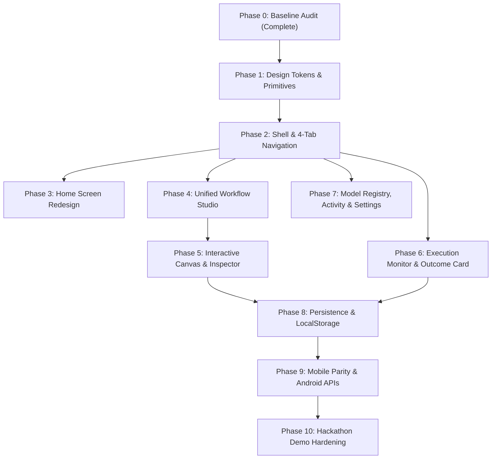

# EL-06 Frontend Implementation Map
## Phase 0: Baseline, Cleanup & Implementation Audit

**Project:** EL-06 — General-Purpose No-Code AI Automation Platform for Android  
**Team:** SATYAGRAH 2.0  
**Status:** Phase 0 Baseline Audit Complete  
**Date:** October 2026  
**Document Type:** Baseline Technical & Architectural Audit Map  

---

## 1. Current Frontend Stack

The frontend stack was verified directly from [`package.json`](file:///home/mandar/Desktop/mandar/trash/dj/ai-automation-platform/package.json), `package-lock.json`, and source files:

- **Frontend framework:** React 18.3.1 (`react`, `react-dom`)
- **Build tool:** Vite 5.4.11 (`@vitejs/plugin-react` 4.3.4)
- **Language:** TypeScript 5.6.3 (`strict: true`, target `ES2020`, JSX `react-jsx`)
- **Styling approach:** Pure Vanilla CSS in single file [`src/index.css`](file:///home/mandar/Desktop/mandar/trash/dj/ai-automation-platform/src/index.css) (842 lines). Zero Tailwind, zero CSS Modules, zero CSS-in-JS.
- **Component system:** Custom React functional components. No external UI component library (no Radix, no shadcn/ui, no Material UI).
- **Routing:** Component-level conditional state (`currentTab`, `isExecuting`, `selectedWorkflowDetail`) inside [`src/App.tsx`](file:///home/mandar/Desktop/mandar/trash/dj/ai-automation-platform/src/App.tsx). Zero routing library (no `react-router`).
- **State management:** React `useState` at the view root + Singleton domain managers using the Subscriber/Observer pattern (`DeviceContextManager`, `NotificationActionController`, `IntermediateResultCache`, `ModelLifecycleManager`, `ExecutionHistoryStore`, `AndroidActionLayer`, `WorkflowEngine`). Zero Redux, Zustand, or MobX.
- **Animation:** Minimal CSS transitions (`transition: all 0.15s ease`) and keyframe pulses (`.status-RUNNING`). No Framer Motion or Motion for React installed.
- **Icons:** Inline Unicode glyphs (`⊞`, `✦`, `☍`, `☰`, `⚙`, `⏱`, `🛡`, `✓`, `▶`, `✕`). No icon library installed.
- **Testing:** Vitest 2.1.8 with 5 test suites (22 tests, 100% passing).
- **Relevant frontend dependencies:** `tesseract.js: ^7.0.0` (for on-device WebAssembly OCR inference).

---

## 2. Repository / Git Baseline

### Git Status & Branch Inspection
- **Current Branch:** `main` (synchronized with `origin/main` at commit `acf8742`).
- **Recent Commit History:**
  - `acf8742` - `fix(el06): restore original frontend and remove neo-brutalist redesign`
  - `b1208e8` - `feat(el06): complete frontend and automation platform`
  - `996a749` - `feat(el06): real vertical slice implementation, android build structure, and tests`

### Working-Tree Changes Audit
The working tree currently has 5 modified files and 4 untracked files:

1. **`modified: .gitignore`**
   - *Nature:* Project build hygiene setup. Adds rules for Vite cache (`.vite/`), Android native build caches (`android/.cxx/`, `android/.externalNativeBuild/`, `android/captures/`), and Gradle wrapper zip downloads (`android/gradle/*.zip`).
   - *Assessment:* Clean, legitimate project configuration. **Must be kept.**

2. **`modified: android/app/build.gradle.kts`**
   - *Nature:* Android SDK target update. Updates `compileSdk` from 33 to 34 and `targetSdk` from 33 to 34 to match Android 14 requirements.
   - *Assessment:* Legitimate Android architecture layer update. **Must be kept.**

3. **`modified: android/gradlew` & `android/gradlew.bat`**
   - *Nature:* Standard Gradle wrapper scripts generated when Gradle 8.5 wrapper was verified/installed.
   - *Assessment:* Standard toolchain files. **Must be kept.**

4. **`modified: package-lock.json`**
   - *Nature:* Minor platform libc metadata normalization from running `npm install` on the Linux host.
   - *Assessment:* Normal npm lockfile behavior. **Must be kept.**

5. **`untracked: android/gradle/wrapper/gradle-wrapper.jar`**
   - *Nature:* Standard Gradle wrapper execution binary jar. Required for `./gradlew` builds.
   - *Assessment:* Legitimate toolchain file. **Must be kept.**

6. **`untracked: docs/FRONTEND_AUDIT.md`**
   - *Nature:* Comprehensive technical and UX baseline audit document (1,321 lines) produced in the prior audit task.
   - *Assessment:* Core documentation artifact. **Must be kept.**

7. **`untracked: docs/UI_DESIGN_SYSTEM.md` & `geminie-claude.md`**
   - *Nature:* Project Design Constitution ("Obsidian + Warm White + Burnt Orange") and 15 frontend guidelines.
   - *Assessment:* Source of truth for future design-system phases. **Must be kept.**

**Directive:** No working-tree changes were reverted. No git resets or cleanups were performed.

---

## 3. Frontend Directory Structure

```text
ai-automation-platform/
├── src/
│   ├── App.tsx                     # Top-level state container, conditional router, and inline workflow library view
│   ├── main.tsx                    # React DOM root entry point mounting <App /> in StrictMode
│   ├── index.css                   # Global CSS stylesheet containing variables, resets, and all component styles
│   ├── types/                      # Strongly typed domain model contracts
│   │   ├── workflow.ts             # Graph schemas, nodes, edges, capabilities, datatypes, validation diagnostics
│   │   ├── model.ts                # Model specs, hardware delegates, quantization tiers, scoring breakdowns
│   │   ├── device.ts               # Hardware telemetry, thermals, battery, RAM, network states
│   │   └── execution.ts            # Execution reports, step telemetry records, cache entry structures
│   ├── core/                       # Clean Architecture Core: autonomous orchestration and reasoning logic
│   │   ├── workflow/               # DAG validator (DFS/Kahn's), async execution engine, NL planner, receipt parser
│   │   ├── model/                  # Model catalog registry, multi-factor scoring selector, LRU memory lifecycle
│   │   ├── resources/              # Device context manager, hardware API telemetry detection, scenario presets
│   │   ├── routing/                # Local (NPU/GPU/CPU) vs Cloud execution decision matrix
│   │   ├── runtime/                # AI inference dispatcher, real Tesseract.js WASM on-device OCR engine
│   │   ├── cache/                  # Deterministic FNV-1a / Murmur intermediate result cache
│   │   ├── actions/                # Android OS bridge (Camera, Mic, Storage sandbox, SQLite ledger)
│   │   └── notification/           # Single notification controllable action controller & state machine
│   ├── data/                       # In-memory stores and default pipeline templates
│   │   ├── templates.ts            # 4 pre-configured Problem Statement workflow pipelines (Finance, Education, Plant, Meeting)
│   │   └── history-store.ts        # In-memory execution history store with pre-seeded demo runs
│   └── ui/                         # Presentation layer: user interface screens and components
│       ├── components/             # Reusable UI components
│       │   ├── TopBar.tsx          # Simulated Android status bar + sticky single notification controllable action
│       │   ├── BottomNav.tsx       # 7-tab bottom navigation bar with Unicode icons
│       │   ├── DAGVisualizer.tsx   # SVG bezier curves + DOM absolute-positioned node cards
│       │   ├── DeviceResourceModal.tsx # Interactive edge constraint simulation modal with sliders & presets
│       │   └── ExplainabilityModal.tsx # "Why this model?" multi-factor scoring justification modal
│       └── screens/                # Primary screen views
│           ├── HomeScreen.tsx      # Dashboard hero prompt input, device readiness card, verified pipelines
│           ├── CreateScreen.tsx    # NL workflow planner, slot extraction display, synthesized DAG, schema viewer
│           ├── VisualBuilderScreen.tsx # Interactive DAG canvas, component palette, node inspector panel
│           ├── WorkflowDetailScreen.tsx# Read-only pipeline step inspection view
│           ├── ExecutionMonitorScreen.tsx # Live execution telemetry, timeline logs, real image upload, output modals
│           ├── ModelRegistryScreen.tsx # Model search/filter catalog and spec inspection dialog
│           ├── ActivityScreen.tsx  # Execution audit trail history cards and raw JSON audit modal
│           └── SettingsScreen.tsx  # Cloud offload privacy switch, memory unloader, cache purge trigger
```

---

## 4. Entry Points

- **HTML Document Entry:** [`index.html`](file:///home/mandar/Desktop/mandar/trash/dj/ai-automation-platform/index.html) defines viewport metadata (`width=device-width, initial-scale=1.0`), page title, and mounts `#root`.
- **Application Bootstrapper:** [`src/main.tsx`](file:///home/mandar/Desktop/mandar/trash/dj/ai-automation-platform/src/main.tsx) imports [`src/index.css`](file:///home/mandar/Desktop/mandar/trash/dj/ai-automation-platform/src/index.css) and renders `<App />` via `ReactDOM.createRoot`.
- **Root Controller Component:** [`src/App.tsx`](file:///home/mandar/Desktop/mandar/trash/dj/ai-automation-platform/src/App.tsx) maintains primary navigation state, manages modal toggles, and handles screen routing.
- **Global Stylesheet:** [`src/index.css`](file:///home/mandar/Desktop/mandar/trash/dj/ai-automation-platform/src/index.css) contains global resets, typography rules, and CSS token variables.
- **Design Token Root:** `:root` in `src/index.css` (lines 1–38).

---

## 5. Routing

The application does **not** use `react-router`, hash routing, or browser History API. All routing is internal conditional component rendering managed inside [`src/App.tsx`](file:///home/mandar/Desktop/mandar/trash/dj/ai-automation-platform/src/App.tsx):

```text
Current State Route Map

[Virtual Route]               [Component Rendered]          [Triggering Condition]
/                             HomeScreen                    currentTab === 'home' && !isExecuting && !selectedWorkflowDetail
/create                       CreateScreen                  currentTab === 'create' && !isExecuting && !selectedWorkflowDetail
/builder                      VisualBuilderScreen           currentTab === 'builder' && !isExecuting && !selectedWorkflowDetail
/workflows                    Inline Workflow Catalog       currentTab === 'workflows' && !isExecuting && !selectedWorkflowDetail
/models                       ModelRegistryScreen           currentTab === 'models' && !isExecuting && !selectedWorkflowDetail
/activity                     ActivityScreen                currentTab === 'activity' && !isExecuting && !selectedWorkflowDetail
/settings                     SettingsScreen                currentTab === 'settings' && !isExecuting && !selectedWorkflowDetail
/workflow/:id/detail          WorkflowDetailScreen          selectedWorkflowDetail !== null && !isExecuting
/execution/live               ExecutionMonitorScreen        isExecuting === true
```

**Routing Precedence:**
1. `isExecuting === true` $\rightarrow$ `ExecutionMonitorScreen` overrides everything.
2. `selectedWorkflowDetail !== null` $\rightarrow$ `WorkflowDetailScreen` overrides `currentTab`.
3. Default $\rightarrow$ Screen mapped to `currentTab`.

---

## 6. Navigation

### Navigation Components
1. **[`BottomNav.tsx`](file:///home/mandar/Desktop/mandar/trash/dj/ai-automation-platform/src/ui/components/BottomNav.tsx):**
   - Fixed to viewport bottom (`position: fixed; bottom: 0;`).
   - Renders 7 tabs: `Home` (`⊞`), `NL Create` (`✦`), `Visual Builder` (`☍`), `Workflows` (`☰`), `Models` (`⚙`), `Activity` (`⏱`), `Settings` (`🛡`).
   - Clicking any tab sets `isExecuting = false`, `selectedWorkflowDetail = null`, and updates `currentTab`.
2. **[`TopBar.tsx`](file:///home/mandar/Desktop/mandar/trash/dj/ai-automation-platform/src/ui/components/TopBar.tsx):**
   - System Status Bar: Displays time, device model, network state, RAM, battery, thermals, and `⚙️ Simulate Device` button (opens `DeviceResourceModal`).
   - Single Notification Controllable Action: Sticky notification banner showing active workflow title, subtitle, progress bar, and `View Live Graph` button (sets `isExecuting = true`).
3. **Cross-Screen Transitions:**
   - Home prompt submission $\rightarrow$ calls `handleStartNLPlan(prompt)` $\rightarrow$ sets `initialNLPrompt`, navigates to `create`.
   - Home card "Inspect DAG" $\rightarrow$ calls `handleSelectWorkflow(wf)` $\rightarrow$ opens `WorkflowDetailScreen`.
   - Home card "Execute Pipeline" $\rightarrow$ calls `handleRunWorkflow(wf)` $\rightarrow$ sets `activeWorkflow`, opens `ExecutionMonitorScreen`.
   - CreateScreen "Edit in Visual Builder" $\rightarrow$ sets `activeWorkflow = generatedWorkflow`, navigates to `builder`.
   - ExecutionMonitorScreen "← Back to DAG" $\rightarrow$ sets `isExecuting = false`.

---

## 7. Component Architecture

### Reusable UI Components
- **[`TopBar`](file:///home/mandar/Desktop/mandar/trash/dj/ai-automation-platform/src/ui/components/TopBar.tsx):** System status header and sticky notification banner. Subscribes to `DeviceContextManager` and `NotificationActionController`.
- **[`BottomNav`](file:///home/mandar/Desktop/mandar/trash/dj/ai-automation-platform/src/ui/components/BottomNav.tsx):** Fixed bottom navigation bar.
- **[`DAGVisualizer`](file:///home/mandar/Desktop/mandar/trash/dj/ai-automation-platform/src/ui/components/DAGVisualizer.tsx):** SVG bezier curves + DOM node elements. Reused across `CreateScreen`, `VisualBuilderScreen`, `WorkflowDetailScreen`, and `ExecutionMonitorScreen`.
- **[`DeviceResourceModal`](file:///home/mandar/Desktop/mandar/trash/dj/ai-automation-platform/src/ui/components/DeviceResourceModal.tsx):** Telemetry simulator modal with sliders for RAM, battery, thermal status, network state, and cloud toggle.
- **[`ExplainabilityModal`](file:///home/mandar/Desktop/mandar/trash/dj/ai-automation-platform/src/ui/components/ExplainabilityModal.tsx):** Multi-factor scoring inspector modal showing capability, quality, latency, hardware, battery, and memory fit.

### Screen Components
- **[`HomeScreen`](file:///home/mandar/Desktop/mandar/trash/dj/ai-automation-platform/src/ui/screens/HomeScreen.tsx):** Hero prompt bar, 3 suggestion chips, device runtime readiness card, verified workflow cards grid.
- **[`CreateScreen`](file:///home/mandar/Desktop/mandar/trash/dj/ai-automation-platform/src/ui/screens/CreateScreen.tsx):** NL input form, slot extraction breakdown, step logs, synthesized DAG preview, JSON schema viewer.
- **[`VisualBuilderScreen`](file:///home/mandar/Desktop/mandar/trash/dj/ai-automation-platform/src/ui/screens/VisualBuilderScreen.tsx):** Template switchers, validation status alert, DAG canvas, node palette, selected node property inspector.
- **[`WorkflowDetailScreen`](file:///home/mandar/Desktop/mandar/trash/dj/ai-automation-platform/src/ui/screens/WorkflowDetailScreen.tsx):** Read-only DAG visualizer and sequential node cards list.
- **[`ExecutionMonitorScreen`](file:///home/mandar/Desktop/mandar/trash/dj/ai-automation-platform/src/ui/screens/ExecutionMonitorScreen.tsx):** Live execution dashboard, camera image uploader, receipt presets, telemetry progress, execution timeline, diagnostics log console, output preview modals.
- **[`ModelRegistryScreen`](file:///home/mandar/Desktop/mandar/trash/dj/ai-automation-platform/src/ui/screens/ModelRegistryScreen.tsx):** Model search input, capability filter, local/cloud buttons, model card grid, spec JSON modal.
- **[`ActivityScreen`](file:///home/mandar/Desktop/mandar/trash/dj/ai-automation-platform/src/ui/screens/ActivityScreen.tsx):** Execution audit history cards list, clear history trigger, audit telemetry modal.
- **[`SettingsScreen`](file:///home/mandar/Desktop/mandar/trash/dj/ai-automation-platform/src/ui/screens/SettingsScreen.tsx):** Cloud privacy checkbox, model memory lifecycle stats & unloader, result cache metrics & purge button.

---

## 8. Styling Architecture

- **Single CSS File:** [`src/index.css`](file:///home/mandar/Desktop/mandar/trash/dj/ai-automation-platform/src/index.css) (842 lines).
- **CSS Reset:** Standard universal box-sizing, margin/padding 0 on `*`.
- **CSS Custom Properties:** Defined on `:root` (lines 1–38).
- **Class Naming Convention:** BEM-like functional class naming:
  - Containers: `.app-container`, `.main-content`, `.hero-box`, `.card-grid`
  - Components: `.workflow-card`, `.dag-node-element`, `.timeline-step`, `.modal-dialog`
  - Elements: `.status-pill`, `.status-dot`, `.location-badge`, `.btn-primary`, `.btn-secondary`
- **Responsive System:** Single media query `@media (max-width: 768px)` at lines 827–842 adjusting padding, stacking `.nl-input-wrapper` vertically, and switching `.card-grid` to single-column layout.

---

## 9. Current Design Tokens

Recorded from [`src/index.css`](file:///home/mandar/Desktop/mandar/trash/dj/ai-automation-platform/src/index.css#L1-L38):

| Token Category | Token Variable | Current Value | Visual Character |
|---|---|---|---|
| **Backgrounds** | `--bg-app` | `#0b0e14` | Deep cool navy black |
| | `--bg-surface-0` | `#10151f` | Dark slate navy |
| | `--bg-surface-1` | `#161c29` | Slate surface |
| | `--bg-surface-2` | `#1e2638` | Elevated slate |
| | `--bg-surface-3` | `#273147` | Active slate |
| **Borders** | `--border-subtle` | `#1e2638` | Subtle navy border |
| | `--border-default` | `#28334a` | Slate border |
| | `--border-focus` | `#3b82f6` | Blue focus |
| **Text** | `--text-primary` | `#f1f5f9` | Off-white (Slate 100) |
| | `--text-secondary` | `#94a3b8` | Medium slate |
| | `--text-muted` | `#64748b` | Muted slate |
| **Accents** | `--accent-cyan` | `#06b6d4` | Cyan (AI highlight) |
| | `--accent-teal` | `#14b8a6` | Teal (AI capability) |
| | `--accent-blue` | `#3b82f6` | Blue (Primary action) |
| | `--accent-indigo` | `#6366f1` | Indigo |
| **Status** | `--status-success` | `#10b981` | Emerald green |
| | `--status-warning` | `#f59e0b` | Amber |
| | `--status-error` | `#ef4444` | Red |
| | `--status-running` | `#3b82f6` | Blue |
| | `--status-fallback`| `#8b5cf6` | Violet |
| **Typography** | `--font-sans` | `'Inter', sans-serif` | UI text |
| | `--font-mono` | `'JetBrains Mono', monospace` | Telemetry & IDs |
| **Border Radii**| `--radius-xs` | `3px` | Badges |
| | `--radius-sm` | `6px` | Buttons, inputs |
| | `--radius-md` | `8px` | Cards, modals |
| | `--radius-lg` | `12px` | Containers |
| **Shadows** | `--shadow-sm` | `0 1px 3px rgba(0,0,0,0.4)` | Subtle lift |
| | `--shadow-md` | `0 4px 12px rgba(0,0,0,0.5)`| Popovers |
| | `--shadow-lg` | `0 10px 25px rgba(0,0,0,0.6)`| Modals |

---

## 10. Design-System Gap Analysis

Comparison between **Current Prototype** and the target **EL-06 Design Constitution** ([`docs/UI_DESIGN_SYSTEM.md`](file:///home/mandar/Desktop/mandar/trash/dj/ai-automation-platform/docs/UI_DESIGN_SYSTEM.md)):

```text
Current Implementation vs. Target EL-06 Design System

Already Aligned:
- Typography: Inter for UI and JetBrains Mono for technical telemetry is already implemented.
- Clean typography hierarchy and monospace formatting for numbers, RAM, latency.
- Restrained card structures without heavy 3D skeuomorphism or glassmorphism.
- Functional layout: Zero rainbow gradients, zero decorative floating blobs.

Partially Aligned:
- Surfaces: Current surfaces are dark slate/navy (#0b0e14 / #161c29), whereas target is warm obsidian (#080806 / #0D0C0A / #131210).
- Borders: Currently #28334a (cool slate), target is #28251F (warm subtle) and #353129 (strong).
- Text: Primary text #f1f5f9 is close to target #F2F0EA, but secondary #94a3b8 is cool slate rather than warm stone #A7A39B.

Not Aligned:
- Accent Colors: Current prototype uses Cyan (#06b6d4) and Blue (#3b82f6) as dominant accents. Target constitution strictly mandates: OBSIDIAN + WARM WHITE + BURNT ORANGE (#D97752). Cyan, blue, and purple accents are strictly forbidden as general accents.
- Semantic Status: Status colors are standard saturated Tailwind colors (#10b981, #ef4444). Target requires muted earthy tones (#7FA66A success, #D59A52 warning, #C85B4A error).
- Navigation Icons: Current BottomNav uses Unicode symbols (⊞, ✦, ☍, ☰, ⚙, ⏱, 🛡). Constitution rule 8 strictly forbids Unicode/emojis and requires Lucide icons.
- Navigation Structure: BottomNav has 7 tabs. Constitution rule 9 mandates 4 primary tabs: Home, Studio, Workflows, Activity. Models and Settings must be secondary header destinations.
- Node Colors: Current DAGVisualizer uses 4 saturated colors (cyan, teal, amber, purple). Target constitution requires minimal warm-neutral node styling with burnt-orange selection border.

Missing:
- Lucide icon family integration.
- Motion for React animation library for smooth state transitions.
- Standardized primitive components (Button, Input, Card, Badge, Dialog, Drawer, Select).
- Unified "Workflow Studio" combining NL Create + Visual Builder.
- User-first high-level result card in Execution Monitor.
```

---

## 11. Home / NL Create Architecture

```text
User Input Text (HomeScreen or CreateScreen)
    ↓
Component State (prompt: string)
    ↓
NLWorkflowPlanner.planFromPrompt(prompt) (src/core/workflow/nl-planner.ts)
    ├── Trigger Slot Extractor (Camera, Audio, File, Manual)
    ├── Domain Classifier (Finance, Education, Healthcare, Productivity, General)
    ├── Capability Decomposer (OCR, STT, Concepts, Summary, Quiz, Plant, Tasks)
    ├── Transform & Action Mapper (Calculate Total, Expense DB, Notes DB, Care Plan DB)
    └── Procedural DAG Synthesizer (constructWorkflow())
    ↓
DAG Schema Object (Workflow: nodes[], edges[])
    ↓
DAGValidator.validate(workflow) (src/core/workflow/dag-validator.ts)
    ├── DFS Cycle Detector (Recursion Stack)
    ├── Edge Source/Target Existence Check
    ├── Data-Type Compatibility Verifier (isDataConvertible)
    └── Kahn's Topological Order Sorter
    ↓
UI Result (CreateScreen)
    ├── Detected Domain Badge
    ├── Extracted Slots Breakdown Grid
    ├── Step-by-Step Reasoner Log Entries
    ├── DAGVisualizer SVG Canvas Preview
    └── JSON Schema View Toggle
    ↓
Next Action
    ├── "Edit in Visual Builder" (transfers workflow to VisualBuilderScreen)
    └── "Run Workflow Now" (initiates WorkflowEngine execution)
```

---

## 12. Visual Builder Architecture

- **Canvas Implementation:** Custom DOM + SVG hybrid inside [`src/ui/components/DAGVisualizer.tsx`](file:///home/mandar/Desktop/mandar/trash/dj/ai-automation-platform/src/ui/components/DAGVisualizer.tsx).
- **Node Representation:** HTML `div` with class `.dag-node-element` positioned via inline CSS `left` and `top`.
- **Edge Representation:** SVG `<path>` elements using cubic bezier curves (`M ... C ...`) with SVG arrowhead markers (`#dag-arrow`).
- **Data Structure:** `WorkflowNode` array and `WorkflowEdge` array in `workflow` state.
- **Node Rendering:** Node type indicator, label, capability/model sub-text, status pill, left green input port (non-triggers), right blue output port.
- **Selection State:** Managed by `selectedNodeId` in `VisualBuilderScreen.tsx`. Clicking a node updates `selectedNode` in state and adds `.selected` CSS class.
- **Drag Behavior:**
  - Nodes: **Static / No drag.** Nodes cannot be moved with mouse or touch. Positions are fixed or computed via `x = 60 + index * 240, y = 180`.
  - Edge Ports: **Port-to-port drag is implemented.** Output port has `draggable={true}` and sets `dataTransfer.setData('sourceNodeId', node.id)`. Dropping onto input port triggers `onConnectNodes(srcId, targetId)`.
- **Zoom / Pan Behavior:** **Not implemented.** Canvas is placed inside a container with CSS `overflow: auto`.
- **Node Inspector:** Side panel in `VisualBuilderScreen.tsx` (lines 346–419). Shows node type, label, capability, input/output types, dependencies, "Delete Node" button, and an editable `executionPolicy` dropdown (`AUTO`, `FORCE_LOCAL`, `FORCE_CLOUD`, `BATTERY_CONSERVE`).
- **Validation:** Live validation on every change via `DAGValidator.validate(workflow)`. Displays green success banner or red diagnostics error list.
- **Save / Load Behavior:** Buttons to load 3 pre-built templates (Bill, Lecture, Plant). Changes are kept in React component state only (not saved to disk/localStorage).

---

## 13. Workflow State / Logic Boundaries

```text
================================================================================
LAYER 1: PRESENTATION (src/ui/)
--------------------------------------------------------------------------------
Screens:        HomeScreen, CreateScreen, VisualBuilderScreen,
                WorkflowDetailScreen, ExecutionMonitorScreen,
                ModelRegistryScreen, ActivityScreen, SettingsScreen
Components:     TopBar, BottomNav, DAGVisualizer, DeviceResourceModal,
                ExplainabilityModal
Responsibility: Renders UI, gathers user input, triggers state transitions.
MUST NOT:       Directly mutate model weights, change scoring formulas, or
                bypass DAGValidator.

================================================================================
LAYER 2: APPLICATION & NAVIGATION STATE (src/App.tsx)
--------------------------------------------------------------------------------
State:          currentTab, activeWorkflow, isExecuting,
                selectedWorkflowDetail, isDeviceModalOpen, initialNLPrompt
Responsibility: Top-level view routing, workflow selection, modal visibility.

================================================================================
LAYER 3: WORKFLOW CONTRACTS & VALIDATION (src/types/, src/core/workflow/)
--------------------------------------------------------------------------------
Contracts:      src/types/workflow.ts (WorkflowNode, WorkflowEdge, Workflow)
Validation:     src/core/workflow/dag-validator.ts (DFS cycles, Kahn's sort)
Planner:        src/core/workflow/nl-planner.ts (Slot & intent extractor)
Arithmetic:     src/core/workflow/receipt-parser.ts (Deterministic math)
Responsibility: Graph integrity, cycle prevention, type compatibility, math.
CRITICAL RULE:  DO NOT MODIFY DAG VALIDATOR OR PARSER LOGIC DURING UI WORK.

================================================================================
LAYER 4: DECISION & RESOURCE RUNTIME (src/core/model/, routing/, resources/)
--------------------------------------------------------------------------------
Model Catalog:  src/core/model/registry.ts (18 model specifications)
Model Selector: src/core/model/selector.ts (Multi-factor scoring formula)
Memory Manager: src/core/model/lifecycle.ts (2048MB budget, LRU eviction)
Router:         src/core/routing/execution-router.ts (Local/Cloud decision matrix)
Device Context: src/core/resources/device-context.ts (Telemetry state & presets)
Cache:          src/core/cache/result-cache.ts (Deterministic SHA-256 / FNV-1a)
Responsibility: Autonomous model selection, OOM prevention, routing policies.
CRITICAL RULE:  DO NOT MODIFY SCORING WEIGHTS OR ROUTING LOGIC DURING UI WORK.

================================================================================
LAYER 5: EXECUTION & ACTION RUNTIME (src/core/workflow/engine.ts, runtime/, actions/)
--------------------------------------------------------------------------------
Engine:         src/core/workflow/engine.ts (Topological execution iterator)
AI Runtime:     src/core/runtime/ai-runtime.ts (Inference dispatcher)
OCR Engine:     src/core/runtime/ocr-engine.ts (Tesseract.js WASM on-device)
Action Bridge:  src/core/actions/android-actions.ts (Camera, Storage, SQLite)
Notification:   src/core/notification/notification-controller.ts
Responsibility: Live execution, event streaming, fallback recovery, actions.
CRITICAL RULE:  DO NOT MODIFY ENGINE STATE MACHINE DURING UI WORK.

================================================================================
LAYER 6: ANDROID NATIVE PLATFORM LAYER (android/)
--------------------------------------------------------------------------------
Files:          android/app/src/main/java/com/satyagrah/el06/...
Responsibility: Kotlin Room database, CameraX adapter, Android notifications.
CRITICAL RULE:  DO NOT TOUCH ANDROID SOURCE CODE DURING FRONTEND-ONLY PHASES.
================================================================================
```

---

## 14. Package Dependencies

### Current Dependencies Categorization

| Category | Package | Version | Purpose |
|---|---|---|---|
| **Core Framework** | `react` | `^18.3.1` | React runtime |
| | `react-dom` | `^18.3.1` | DOM renderer |
| **Inference Runtime** | `tesseract.js` | `^7.0.0` | On-device WASM OCR engine |
| **Build & Tooling** | `vite` | `^5.4.11` | Dev server & bundler |
| | `@vitejs/plugin-react` | `^4.3.4` | Vite React plugin |
| | `typescript` | `^5.6.3` | Type checker & compiler |
| | `@types/react` | `^18.3.12` | React type declarations |
| | `@types/react-dom` | `^18.3.1` | React DOM type declarations |
| **Testing** | `vitest` | `^2.1.8` | Test runner (22 unit tests) |

### Missing Packages from Design Constitution
The following libraries are recommended by `docs/UI_DESIGN_SYSTEM.md` but are **not** yet installed:
- `lucide-react` (for consistent modern icons, replacing Unicode characters)
- `motion` (or `framer-motion`, for restrained state animations)
- `@xyflow/react` (for true interactive drag/zoom/pan DAG canvas, evaluated for Phase 2/5)

**Directive:** Zero packages were installed during Phase 0. Dependencies will be installed in subsequent deliberate phases.

---

## 15. Reusable Components

### Current Reuse Inventory

#### KEEP / REUSE
- **[`ExplainabilityModal.tsx`](file:///home/mandar/Desktop/mandar/trash/dj/ai-automation-platform/src/ui/components/ExplainabilityModal.tsx):** High-value multi-factor scoring inspector modal. Shows exact mathematical breakdown ($S_{\text{cap}}, S_{\text{acc}}, S_{\text{lat}}, S_{\text{hw}}, S_{\text{bat}}, S_{\text{mem}}$) and competing candidates. Keep underlying data structure; only restyle to warm obsidian palette.
- **[`DeviceResourceModal.tsx`](file:///home/mandar/Desktop/mandar/trash/dj/ai-automation-platform/src/ui/components/DeviceResourceModal.tsx):** Essential simulation tool for hackathon judges with preset scenarios (Flagship, Budget, Offline Critical). Keep functionality; restyle sliders and cards.
- **[`ReceiptParser`](file:///home/mandar/Desktop/mandar/trash/dj/ai-automation-platform/src/core/workflow/receipt-parser.ts):** Deterministic arithmetic calculation engine. Keep 100% intact.
- **[`RealOCREngine`](file:///home/mandar/Desktop/mandar/trash/dj/ai-automation-platform/src/core/runtime/ocr-engine.ts):** Real on-device Tesseract.js WASM engine. Keep 100% intact.

---

## 16. Components to Adapt

- **[`TopBar.tsx`](file:///home/mandar/Desktop/mandar/trash/dj/ai-automation-platform/src/ui/components/TopBar.tsx):**
  - *Adaptation:* Convert from cool slate background to `#080806` / `#0D0C0A`. Replace Unicode bell with Lucide `Bell` icon. Preserve the `NotificationActionController` live subscription and progress bar. Add quick-action triggers for Settings and Models in the header.
- **[`BottomNav.tsx`](file:///home/mandar/Desktop/mandar/trash/dj/ai-automation-platform/src/ui/components/BottomNav.tsx):**
  - *Adaptation:* Consolidate from 7 tabs down to 4 primary tabs (`Home`, `Studio`, `Workflows`, `Activity`). Replace Unicode characters with Lucide icons (`Home`, `Layers`, `GitBranch`, `Activity`). Style active state with burnt-orange pill indicator.
- **[`DAGVisualizer.tsx`](file:///home/mandar/Desktop/mandar/trash/dj/ai-automation-platform/src/ui/components/DAGVisualizer.tsx):**
  - *Adaptation:* Restyle node elements to `#0D0C0A` background with thin `#28251F` border and burnt-orange (`#D97752`) selection outline. Replace saturated colored badges with minimal category tags. Add mouse drag coordinate handlers.
- **[`VisualBuilderScreen.tsx`](file:///home/mandar/Desktop/mandar/trash/dj/ai-automation-platform/src/ui/screens/VisualBuilderScreen.tsx):**
  - *Adaptation:* Restyle palette into a sleek drawer or sidebar. Expand Selected Node Inspector to support full parameter editing.
- **[`ExecutionMonitorScreen.tsx`](file:///home/mandar/Desktop/mandar/trash/dj/ai-automation-platform/src/ui/screens/ExecutionMonitorScreen.tsx):**
  - *Adaptation:* Introduce progressive disclosure: place a high-level formatted result card at the top, moving raw JSON and telemetry logs into a collapsible diagnostics tab.

---

## 17. Components to Replace

- **Inline Workflows Tab inside [`src/App.tsx`](file:///home/mandar/Desktop/mandar/trash/dj/ai-automation-platform/src/App.tsx#L97-L134):**
  - *Reason:* Hardcoded markup inside the router file violates clean separation of concerns.
  - *Action:* Replace with standalone screen component `src/ui/screens/WorkflowLibraryScreen.tsx`.
- **Raw `<pre className="code-view">` JSON Blocks in [`CreateScreen.tsx`](file:///home/mandar/Desktop/mandar/trash/dj/ai-automation-platform/src/ui/screens/CreateScreen.tsx#L155) and [`ModelRegistryScreen.tsx`](file:///home/mandar/Desktop/mandar/trash/dj/ai-automation-platform/src/ui/screens/ModelRegistryScreen.tsx#L207):**
  - *Reason:* Displaying unformatted raw JSON to end users degrades visual quality.
  - *Action:* Replace with structured specification cards and copy-to-clipboard JSON dialogs.
- **Ad-hoc Buttons, Inputs, and Cards across all screens:**
  - *Reason:* Inconsistent button classes (`.btn-primary`, `.btn-secondary`, `.btn-notif-action`, `.btn-generate`) with scattered inline styles.
  - *Action:* Replace with standardized `Button`, `Input`, `Card`, and `Badge` primitives.

---

## 18. Components That Need to Be Created

To align with the EL-06 Design Constitution, the following reusable primitives will be created in upcoming phases under `src/ui/components/common/`:

1. **`Button`:** Standardized 3-tier button component (Primary: burnt orange `#D97752`, Secondary: dark surface `#131210`, Ghost: transparent text).
2. **`Input` & `Textarea`:** Obsidian `#0D0C0A` background, warm off-white text, subtle border `#28251F`, burnt-orange focus ring.
3. **`Card`:** `#0D0C0A` container with 1px `#28251F` border and 10px radius.
4. **`Badge` / `StatusPill`:** Compact status indicators using semantic colors (#7FA66A success, #D59A52 warning, #C85B4A error, #D97752 accent).
5. **`Modal` / `Dialog`:** Standardized dialog container with backdrop blur, ESC key dismiss, and header/body/footer slots.
6. **`Drawer` / `Sheet`:** Slide-over drawer for the Selected Node Inspector on tablet and desktop.
7. **`UserOutcomeCard`:** Formatted execution result card (Expense receipt, lecture notes, plant care plan) placed at the top of the Execution Monitor.
8. **`WorkflowStudioScreen`:** Unified workspace screen consolidating `CreateScreen` and `VisualBuilderScreen`.
9. **`WorkflowLibraryScreen`:** Modular workflow catalog screen replacing the inline tab in `App.tsx`.

---

## 19. Current Runtime / UI Issues

1. **Headless Browser Launch Timeout:** In the local agent container environment, headless Chrome times out during `open_browser_url` due to sandbox display server limitations. (Verified: Vite dev server runs cleanly and returns HTTP 200 via `curl -I http://localhost:5173/`).
2. **Static Canvas Nodes:** Nodes in `DAGVisualizer` cannot be dragged or zoomed/panned with mouse or touch.
3. **7-Tab Overcrowding:** BottomNav has 7 tabs using Unicode glyphs, violating Android Material 3 mobile navigation standards.
4. **Color Palette Mismatch:** Current UI relies on cool blue and cyan accents (`#06b6d4`, `#3b82f6`), directly violating the Design Constitution requirement for Obsidian + Warm White + Burnt Orange.
5. **Buried Results in Execution Monitor:** Outcomes are shown inside timeline step JSON objects rather than presented as a clean user-facing result.
6. **Volatile In-Memory State:** Workflows, settings, and execution history reset on browser refresh due to lack of `localStorage` persistence.

---

## 20. Recommended Implementation Boundaries

### Phase 1: Design Tokens & Component Primitives
- **Scope:** Define new CSS variables in `src/index.css` (Obsidian `#080806`, Warm White `#F2F0EA`, Burnt Orange `#D97752`). Build foundational primitives (`Button`, `Input`, `Card`, `Badge`, `Modal`).
- **Boundary:** Do not touch screen logic, router, or workflow engine.

### Phase 2: Application Shell & Navigation
- **Scope:** Streamline `BottomNav` to 4 tabs (`Home`, `Studio`, `Workflows`, `Activity`) with Lucide icons. Update `TopBar` with warm dark theme and header quick-actions. Extract `WorkflowLibraryScreen.tsx` from `App.tsx`.
- **Boundary:** Keep existing screen bodies intact; modify only layout wrappers.

### Phase 3: Home Screen Redesign
- **Scope:** Refactor `HomeScreen` with generous negative space, strong typography, prompt input, problem statement suggestion chips, and clean telemetry card.
- **Boundary:** Do not change prompt handling callback contracts.

### Phase 4: Unified Workflow Studio
- **Scope:** Unify `CreateScreen` and `VisualBuilderScreen` into a single continuous workspace where users can type a prompt, review the generated DAG, and edit visually without tab switching.
- **Boundary:** Use `NLWorkflowPlanner.planFromPrompt` and `DAGValidator.validate` without modifying core planning logic.

### Phase 5: Interactive Canvas & Node Inspector
- **Scope:** Add mouse/touch coordinate dragging for nodes, interactive edge deletion, canvas zoom/pan, and full node property editing in a slide-over inspector drawer.
- **Boundary:** Keep `WorkflowNode` and `WorkflowEdge` schemas unchanged.

### Phase 6: Execution Monitor & Progressive Disclosure
- **Scope:** Implement Tier-1 `UserOutcomeCard` prominently at the top of `ExecutionMonitorScreen`. Organize telemetry, memory meters, and logs into collapsible advanced tabs.
- **Boundary:** Do not alter `WorkflowEngine` event callbacks or execution flow.

### Phase 7: Model Registry, Activity & Settings
- **Scope:** Redesign Model Registry with spec drawers and model comparison; format Activity audit cards; add `localStorage` persistence to settings and history.
- **Boundary:** Core registry catalog remains intact.

### Phase 11: Home Page Refinement, Mobile Hardening & Interactive Landing Experience
- **Scope:** Refine Home page into a focused, product-first entry point. Introduce tactile burnt-orange input focus accent line, 3-step "How It Works" overview (01 Describe, 02 Build, 03 Run), simplified example automations without premature technical metadata overload, and compact standby service status banner in `TopBar`.
- **Responsive Hardening:** Resolve mobile overflow defects by enforcing `min-width: 0`, `max-width: 100%`, `box-sizing: border-box`, and proper `flex-direction: column` on `.el-input-wrapper` / `.el-input-container`. Harden `.el-textarea` and `.el-card` wrapping. Stack mobile prompt action buttons vertically (`CTA` on top, `Open Blank Canvas` below).
- **Boundary:** Core routing, model selection, execution engine, and workflow schemas remain untouched (`src/core/*` and `src/types/workflow.ts` 0 changes).

---

## 21. Phase 1–10 Dependency Map



---

## 22. Files That Must Not Be Modified During Frontend-Only Work

The following core modules contain validated business logic, graph algorithms, and hardware adapters. They **must remain untouched** during visual and UX frontend phases unless explicitly requested:

- [`src/core/workflow/dag-validator.ts`](file:///home/mandar/Desktop/mandar/trash/dj/ai-automation-platform/src/core/workflow/dag-validator.ts) (DFS cycle detection & Kahn's topological sort)
- [`src/core/workflow/engine.ts`](file:///home/mandar/Desktop/mandar/trash/dj/ai-automation-platform/src/core/workflow/engine.ts) (Asynchronous execution state machine)
- [`src/core/workflow/receipt-parser.ts`](file:///home/mandar/Desktop/mandar/trash/dj/ai-automation-platform/src/core/workflow/receipt-parser.ts) (Dynamic arithmetic & regex parsing)
- [`src/core/model/registry.ts`](file:///home/mandar/Desktop/mandar/trash/dj/ai-automation-platform/src/core/model/registry.ts) (18 model catalog specifications)
- [`src/core/model/selector.ts`](file:///home/mandar/Desktop/mandar/trash/dj/ai-automation-platform/src/core/model/selector.ts) (Multi-factor scoring formula & disqualification rules)
- [`src/core/model/lifecycle.ts`](file:///home/mandar/Desktop/mandar/trash/dj/ai-automation-platform/src/core/model/lifecycle.ts) (2048MB memory budget & LRU eviction)
- [`src/core/resources/device-context.ts`](file:///home/mandar/Desktop/mandar/trash/dj/ai-automation-platform/src/core/resources/device-context.ts) (Hardware detection & simulation presets)
- [`src/core/routing/execution-router.ts`](file:///home/mandar/Desktop/mandar/trash/dj/ai-automation-platform/src/core/routing/execution-router.ts) (Decision matrix for Local NPU/GPU/CPU vs Cloud)
- [`src/core/runtime/ai-runtime.ts`](file:///home/mandar/Desktop/mandar/trash/dj/ai-automation-platform/src/core/runtime/ai-runtime.ts) (Inference dispatcher)
- [`src/core/runtime/ocr-engine.ts`](file:///home/mandar/Desktop/mandar/trash/dj/ai-automation-platform/src/core/runtime/ocr-engine.ts) (Tesseract.js WASM on-device engine)
- [`src/core/cache/result-cache.ts`](file:///home/mandar/Desktop/mandar/trash/dj/ai-automation-platform/src/core/cache/result-cache.ts) (Deterministic FNV-1a / Murmur hashing)
- [`src/core/actions/android-actions.ts`](file:///home/mandar/Desktop/mandar/trash/dj/ai-automation-platform/src/core/actions/android-actions.ts) (Android OS API simulation bridge)
- All files under [`android/`](file:///home/mandar/Desktop/mandar/trash/dj/ai-automation-platform/android/) (Native Android/Kotlin code)
- All files under [`tests/`](file:///home/mandar/Desktop/mandar/trash/dj/ai-automation-platform/tests/) (Unit test suites validating vertical slices)

---

*Baseline audit and implementation map frozen for Phase 0. Awaiting user directive to proceed to Phase 1.*
